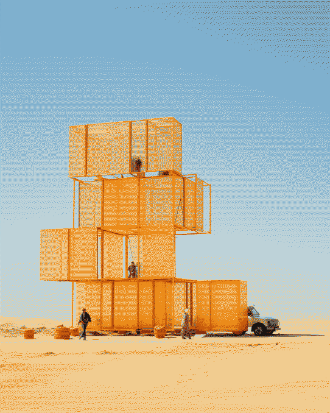
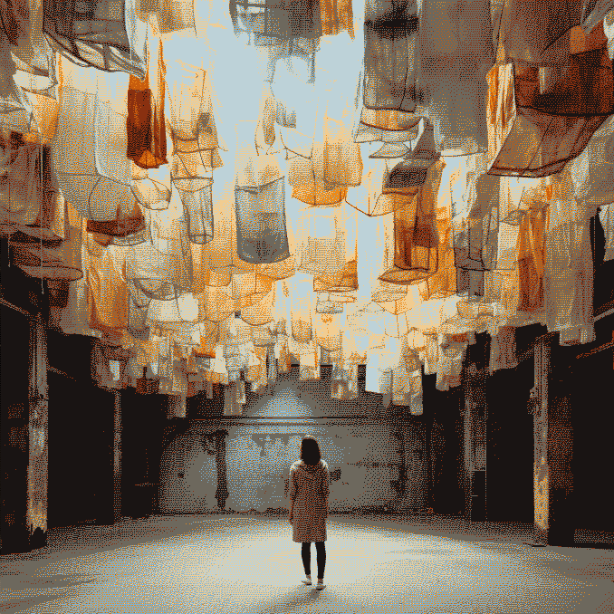
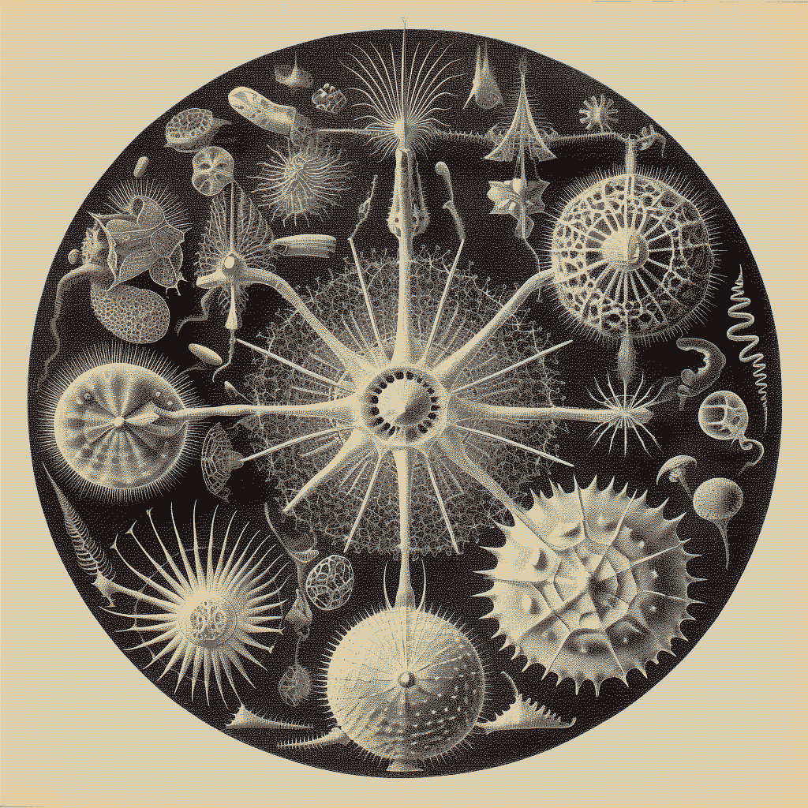
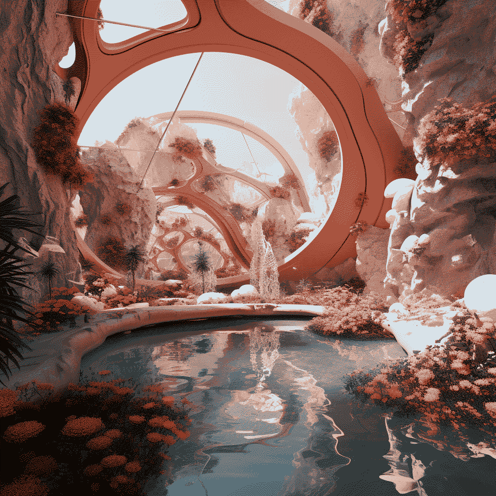
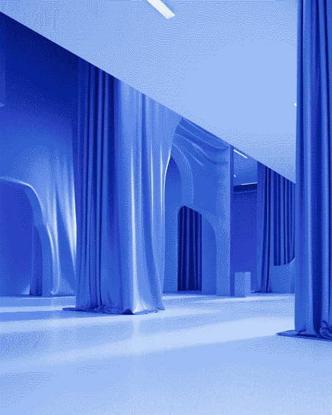
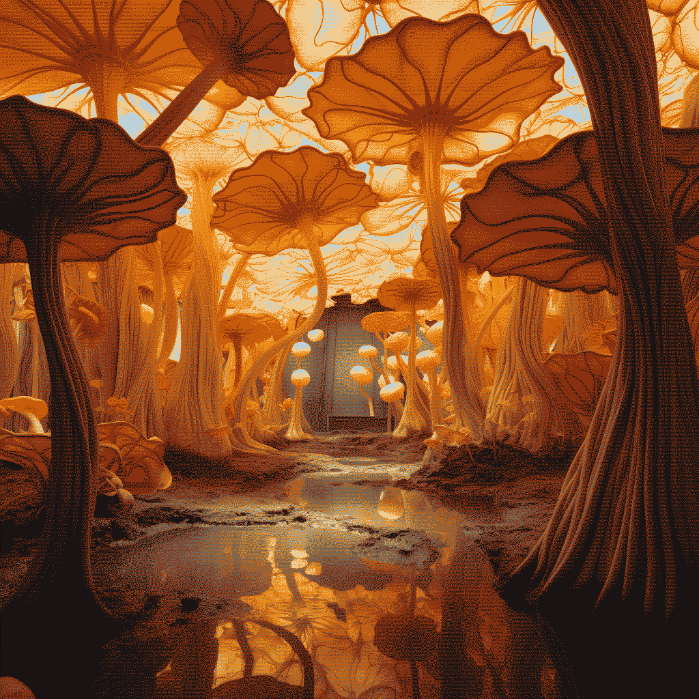

# @Master in Design for Emerging Futures

  <h1 id="typewriter-text"></h1>

(images/Home/dither_it_vania9117_an_imagined_art_installation_exploring_organic_psiloc_ea987261-4f57-41eb-a170-3077a56f61cf.png)  

<!--*add images and gifs here of the build process* -->
<!-- Markdown Content -->

  
  
  
  
  <!-- Add more images as needed -->

<!-- CSS Styles -->

<!--*add images and gifs here of the build process* -->
<!-- Markdown Content -->

  
  
  
  
  <!-- Add more images as needed -->

<!-- CSS Styles -->

Welcome to my journey in the Master of Design for Emerging Futures📓
 
 

  
