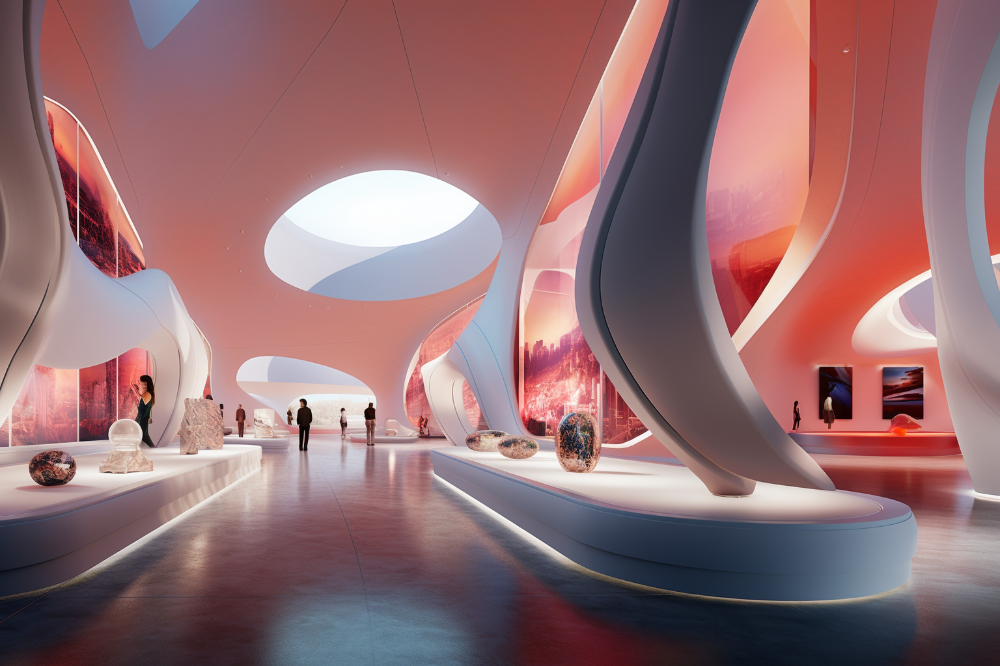
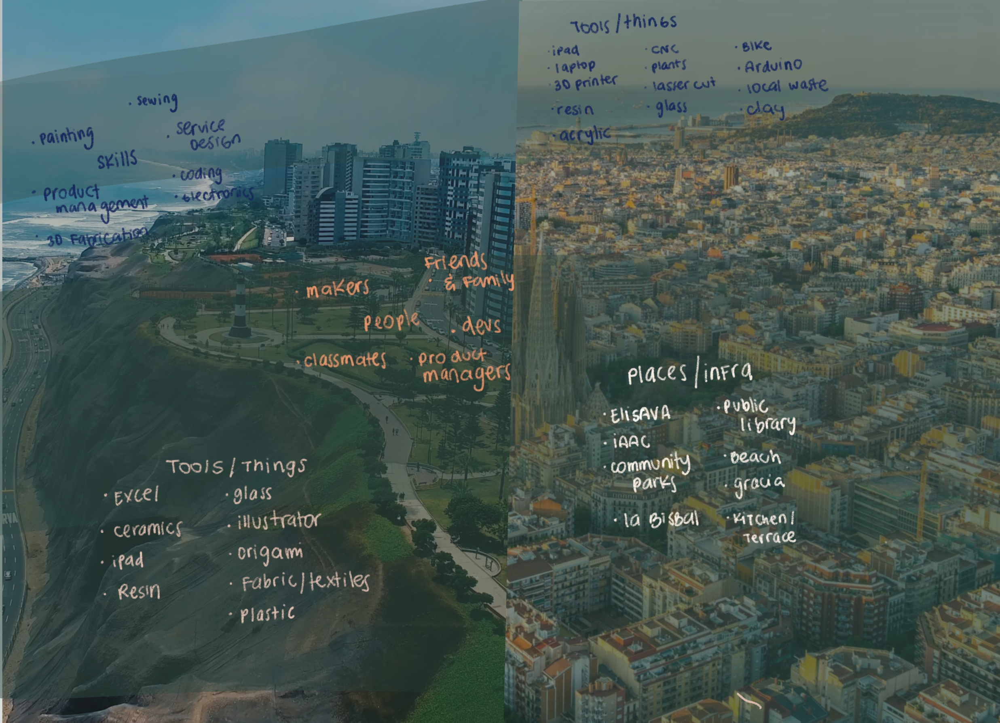
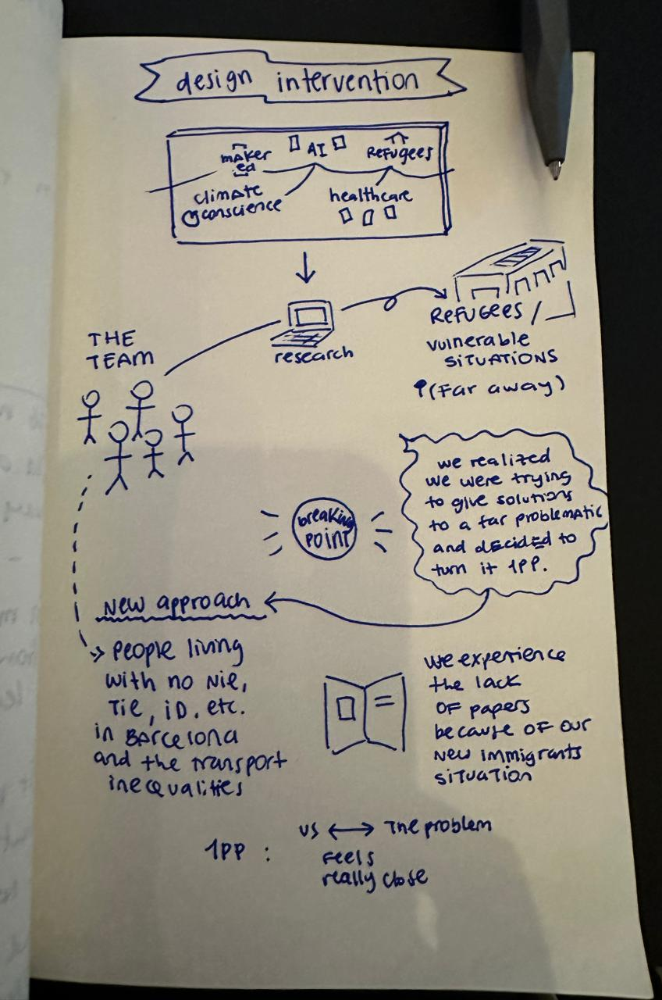
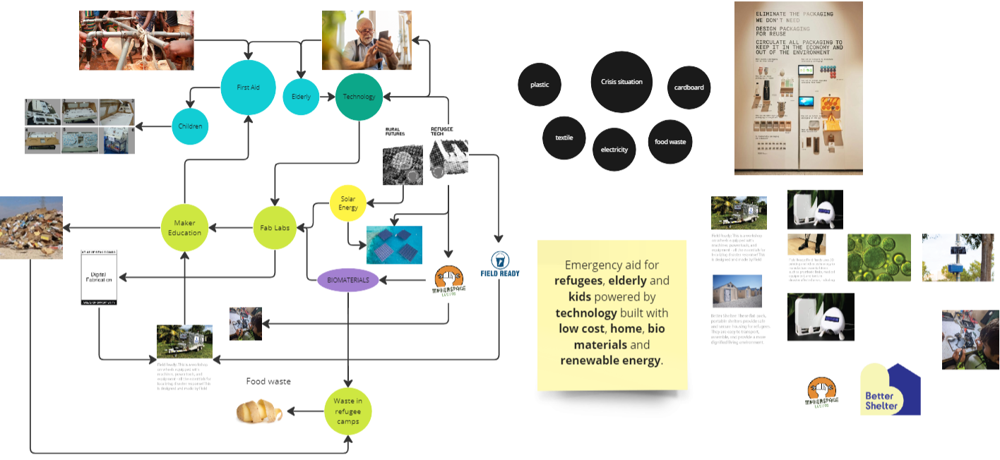

# Design Studio

Some initial notes about first-person research...

Designing objects isn't my background or main field. Now that feels like a barrier, but day by day its bricks are disappearing. I have many different initial ideas of what I want to research, but I feel a bit overwhelmed by all the information about past students, other projects, or ongoing initiatives that I think I need to read about before deciding. While reading about first-person research in HCI, I think about researching the basics of design, how to make this journey the most explorative one to get to know all the design and technological specific areas more.

A third-person point of view to systems implies designing for society in general; a second-person point of view implies designing with a group of people part of society, and a first-person point of view implies designing for yourself within the society and proposed system. To whom should I design?

I used to design digital experiences for companies, definitely third person perspective researches was my way to get to "the truth". I've always had in mind that i'm not the measure of things and i'm not the user persona, to reduce the bias in the design... but 1st person research sounds really magical as well. 

For them, a third-person perspective is non-situated. The designer becomes an expert in the context of the study by taking an objective view and designs for people without involving users and professional experts. Key actions include contextual inquiry, ethnography, surveys, and interviews, to name a few.
 In a second-person perspective, the designer is socially involved and facilitates co-design sessions or other kinds of workshops or forms of participation with users and professional experts who are part of the context. 
 A first-person perspective means that designers are personally involved since they are part of and actors in the system object of study. Designers design for themselves within the context and involve their own experiences in the process. 

I'm intrigued about exploring first-person research. Let's discover it. 

## Roles in prototyping

Roles in prototyping exercise: 

Context: Carmen used to work in **[Incapto](https://incapto.com/?utm_term=incapto%20coffee&utm_campaign=%5BES%5D%20-%20BRAND%20-%20OK&utm_source=adwords&utm_medium=ppc&hsa_acc=3301245231&hsa_cam=20333415320&hsa_grp=150113872719&hsa_ad=664449375970&hsa_src=g&hsa_tgt=kwd-931450959115&hsa_kw=incapto%20coffee&hsa_mt=e&hsa_net=adwords&hsa_ver=3&gclid=CjwKCAjwp8OpBhAFEiwAG7NaEvRY9zEra_wF2MrcB8SFeBBdFup1Mkwc2xGWC-dOYauhzTOLUKURGhoC8DAQAvD_BwE)**. Incapto protyped a new coffee machine with several options for the filter, water and type of coffee. Then they run tests with different types of users to see their reactions and gather insights of this new experience. This was a role 2 prototyping because they used the machine as an instrument of inquiry.

Moreover, I created the following prototype to conduct extra research with role 3 of prototyping. This prototype embodies the concept that you can be a coffee expert at home because of the amount of coffee cups you've had with the machine. This board shows the progress, in levels, of your coffee expertise. 

Who decides who is an coffee expert?

.gif>)

Furthert explanation: Having many buttons and several options in a machine to use at home has given many negative reactions (results from 1st research) so with this proposed prototype Incapto will be able to understand if their users feel more comfortable with this concept and if they are willing to receive extra information related to the level in which they are to complement enhance their "expertise". 

Additional reflection: 
I read the "Prototypes and prototyping in design research" publication really carefully to understand how to divide and dimension these new roles of prototyping in my regular prototyping exercises. It was hard but still figuring out how to identify and also how to explore and/or extend my research with this new perspective. 

# R+D Toolkit 

# Design Intervention 
==============================================================

Building this design intervention was a continuous evolution and a constant reminder of what a first-person perspective (1PP) entails.

Take a look to our intervention: 

<iframe src="https://player.vimeo.com/video/881462379?h=f0315ab7af" width="640" height="363" frameborder="0" allow="autoplay; fullscreen; picture-in-picture" allowfullscreen></iframe>

<a href="https://vimeo.com/881462379">Design Intervention video</a> from <a href="https://vimeo.com/user210653740">Manuja Agnihotri</a> on <a href="https://vimeo.com">Vimeo</a>.

Nevertheless despite that it seems that everything had to do with transport it started in refugees. 
I made a drawing to simplify it: 

As I mentioned before this intervention was a constant reminder of refocusing into 1PP. 
We created a collective design space and started building connections within our classmates. 
Four of us decided to team up to create our own collective design space: 

We brainstormed some ideas and providing maker education to any person in Barcelona related to hygene seemed pretty fair. 

We reflected A LOTTTTT about this design intervention and we decided to bring it more closer. This wasnt 1PP. 
How might we experience something similar to refugees or to someone in a vulnerable situation? We had to reflect about us, our condition, our migration to Barcelona. And it that moment we realized that our process of moving to BCN and not having papers and having to deal with it is a topic to be raised. 

