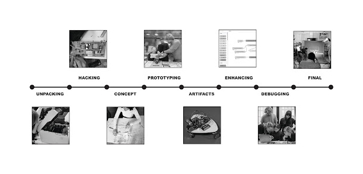

# Machine Paradox
The Machine Paradox project was unexpected, challenging, and fun. Everything began with a division of skills so that the groups became multidisciplinary. Working with Ever, Jorge, Minnie, and Pancha was genuinely interesting due to the different skills each of us possessed. 

](../images/the-machine-paradox-schedule.jpeg)

The project consisted in experiencing the process of building an almost unsuseful machine out of dissasembled parts of old objects. 

- First, we had to choose one non-working object to disassemble. Initially, we chose four, but two of them were actually working. Therefore, we disassembled two objects: a Bose SoundDock 2006 and a vintage Sony Intercom.

- Second, we brainstormed around a concept. We knew that the disassembling part was just the beginning, but we didn't know what was coming. So, working with "anxiety" was the best topic to choose. 

- Third, we iterated over the anxiety machines we could build. Then, we decided on one, created a product backlog, and established a timeline.

Take a look to the process of this experience: 

<iframe src="https://player.vimeo.com/video/881392878?badge=0&amp;autopause=0&amp;quality_selector=1&amp;player_id=0&amp;app_id=58479" frameborder="0" allow="autoplay; fullscreen; picture-in-picture" style="position:absolute;top:0;left:0;width:100%;height:100%;" title="Machine Paradox"></iframe>

And here you will find our final presentation: 
<iframe src="https://docs.google.com/presentation/d/e/2PACX-1vQgerue-YyYcLRTJawOIUOKAdpP8VhmkDQ1P8AJZucsmuzc5au8tcNQx4a_o2y-S16UtLv_2gLkXZEA/embed?start=false&loop=false&delayms=3000" frameborder="0" width="960" height="569" allowfullscreen="true" mozallowfullscreen="true" webkitallowfullscreen="true"></iframe>

Experiencing this process was exhausting, intense, but very enriching. We had a lot of learnings because we put theory into practice, but also a lot of learnings from failures. We developed skills such as 3D printing, laser cutting, Rhino modeling, Arduino coding, and much more. Our final result was fulfilling due to all the hands-on learning we experienced.

If you are curious you can read the forensic reports of the 2 objects we dissasembled. 

**Forensic Report**
===============

| Identity of the reporting agency       | MDEF                           |
|----------------------------------------|--------------------------------|
| Case identifier                        | Forensics of the Obsolescence  |
| Identity of the submitter              | Minnie & the minions
| Date of receipt                        | 17/10/2023                     |
| Date of report                         | 19/10/2023               |
| Identity and signature of the examiner | M&M     			  |
 

## Examination Bose SoundDock 2006

:::warning
Descriptive list of items submitted for examination, including serial number, brand and model

**Serial number: 035704962903925AE** 
**Brand: BOSE** 
**Model: SoundDock Digital Music System 1** 
**Colour: White** 
**Made in: Mexico🌮** 

:::

## Forensic Questions
.gif?raw=true)

**What does it do?** 
This is Bose SoundDock is a speaker system that allows you to dock your iPod (or 30 pin iPhone) directly onto the speaker, providing a convenient and integrated way to play music from your iPod. 

**How does it work?** 
The speaker has a built-in docking station that is compatible with various iPod models. You could connect your iPod directly to the dock, and it would charge your iPod while playing music.

Bose is known for its emphasis on audio quality. The SoundDock aimed to deliver clear, full-range sound for music playback.

It also receives a remote control signal allowing you to control playback, volume, and other functions from a distance.

**How is it built?** 

The SoundDock has a compact and sleek design.
Starting from the outside, it has a docking station that connects and holds the iPod, facilitating audio transfer and charging.
parts were manufactured and assembled in Mexico, we believe in the same factory as the components have the same date of fabrication, from the plastic components to the speakers themselves.

The Bose switching power supply was made by Phihong electronics in China. 
- Input: 100 to 240V. 100-240V 50-60Hz
- Output: 18V,1A,18w

The speakers chasis is put together by a thermo adhesive process that keeps the plastic components together instead of using screws, we guessed it is because of the product being an acoustic box, vibration reduction is a key manufacturing goal.

The power connects to a controller that talks to the 30 pin connector; it is a printed circuit board with integrated circuits. 

 

Internally, there are 2 speaker drivers which produce sound and are crucial for audio quality.These connect to an internal amplifier to boost audio signals for powerful sound.

**Why did it failed, or it wasn't used anymore?**
The docking station was broken when we found, it didn't include the 30 pin dock connector, so it also couldn't receive audio. Moreover the inner sponge surrounding the cabling is melted which created dust for the artifact. 

## Steps taken
1. Tested the speaker with the power supply... not working.
2. Disassembled the screws of the coverage. 
3. Separated the coverage and the speaker component to start diving in. 
4. Dissasembled more screws. 

5. Vaccum all the dust of the melted old sponges. 
6. Separated the components: 2 Printed circuit boards with flex cables, 2 speakers with wires and harness, 1 IR sensor with flex cable. 
7. Researched models and functions of the PCBs.

## Testing
1. Tested the Bose Sound Dock with the power supply... seems not working.
2. Tested if the power cable was working. It was! 18V
3. Tested pin connectors from Power and Processing PCB and DAC PCB, seems to be working, but we haven't been able to input sound to this assembly. 
4. Tested if the PCBs were working, Power and processing PCB was working, DAC PCB, we couldn't make it work without an audio signal.
5. Tested the speaker with new audio input, also working.
6. We found a blog which documented the pins so we tried sending audio through the pins. https://cacharrytos.com/2013/10/27/entrada-de-audio-auxiliar-en-un-sounddock-de-bose/ We sealed the pins and worked!
7. We tested the connection to the amp, it worked.
 
 
 
 
  

## Results

**Does it contain a computer or microcontroller?**
It does have a microcontroller, presumably to interphase with an iPod, take its input, and then send it to the Amplifier PCB that actually outputs sound through the speakers, while still supplying power to both, the speaker array and the iPod itself.

**Did you found any sensors?**
Yes! There was an IR sensor for a remote control. 

**We connected the speakers to a new pcb Josep brought, it worked as an amp, so the speakers work now with an aux.**
 
 
<iframe src="https://giphy.com/embed/najrdJ7FRa7StcIIzw" width="480" height="480" frameBorder="0" class="giphy-embed" allowFullScreen></iframe>
<a href="https://giphy.com/gifs/laguarimba-party-drunk-guarimba-najrdJ7FRa7StcIIzw">via GIPHY</a>

<iframe width="560" height="315" src="https://www.youtube.com/embed/O35P0VyAqlg?si=u-fZ-7FRvBfGPz9_" title="YouTube video player" frameborder="0" allow="accelerometer; autoplay; clipboard-write; encrypted-media; gyroscope; picture-in-picture; web-share" allowfullscreen></iframe>

## Conclusions

The start of reverse engineering on Bose speakers was easily accessible, and the components and product damage were identified. The analysis of the PCB and amplifier took the most time because each individual piece indicated that it was functioning, but when sending audio signals, we couldn't get it to reproduce. Finally, by directly connecting the cables to the speaker, we managed to get sound to play, but at a low volume. Then we found a new PCB and use it as an amplifier and it worked!!

## Opinions

**What did you learn?**

The inner structure of the speaker is tightly sealed and compact to improve sound quality, with more screws on the outer structure and less glue. The plastic layout of the enclosure allows for efficient air movement, and the speaker's shape is designed for better acoustics using two pieces of ABS polymer. In some cases, components can be easily separated to facilitate updates without changing the entire design, such as the iPod input part being separated from the acoustic box for Apple hardware updates.
 

**What surprised you?**

PCBs are intriguing, and we can tell that most of them originates from Mexico (or at least where assembled there). The modularity of the connection dock for the iPod or early iPhone with 30-pin connectors suggests that it might be more convenient for production to replace the entire module while preserving the speaker and amplifier PCB. Initially, we assumed that the main PCB and the speakers would be the primary components due to the amplifier's size and presence

## Images
 .jpeg?raw=true)  
**Pcbs new connection**
 

**Testing to connect it to the amp.** 
 

**Testing Playlist**
<iframe style="border-radius:12px" src="https://open.spotify.com/embed/playlist/7gK40Yp4hNPMvByEEFMn9I?utm_source=generator" width="100%" height="380" frameBorder="0" allowfullscreen="" allow="autoplay; clipboard-write; encrypted-media; fullscreen; picture-in-picture" loading="lazy"></iframe>

Forensic Report II
Bticino Terraneo Pivot 344102 Video Intercom
===============
 

## Examination 

:::warning
Descriptive list of items submitted for examination, including serial number, brand and model.

**Serial number:** 
**Brand: Bticino Terraneo** 
**Model: Pivot 344102 Video Intercom**
**Colour: White** 
**Made in: Italy and Japan**

:::

## Forensic Questions

**What does it do?** 
 It's a phone with a screen that is used for internal communications within a building, including a screen, to be able to see who is outside when ringing a bell, and the ability to open the door remotely.

**How does it work?** 
Through closed connections between devices, and an external camera and bell fob.

**How is it built?** 
It uses many different components, ABS made using injection molding, using standard components from at least two companies.
Btcino made most of the plastic and "phone" components, while the screen is a Sony Walkman TV 4" CRT screen.

**Why did it fail, or it wasn't used anymore?**
As far as we can tell, it was obsolete.
The harness with the input for the cable system was cut at the base. 

## Steps taken
 

1. We disassembled the main body of the phone and the phone handle assembly. There were only 4 screws, the plastic parts were mostly assembled with snap fit joints.
2. We took out the internal components:PCBs, CRT screen, microphone, speakers.
3. We inspected the boards for any indicators for connections
4. We also found the schematics of the feeder component

## Testing
 
1. We tried to supply power in different voltages to see if the parts were in working condition. 

2. As it is an 8 pin system, we test each one of them with the multimeter to distinguish which one is power, video, audio and bus. We managed to map out the pins but had no luck in making the PCB to  work yet. The working theory now is that we might need to connect the other input signals to the PCB aside from the power.

3. At the end we ended up using only the monitor component and applied power directly to it, without using the 8 thread system.

4. We supplied 12 volts power, and an analog video signal with a Raspberry Pi.

 

Next step is to figure out how to input images into it, so we can build cool stuff with it.

## Components

> The disassembled intercom

- Main body and telephone handle enclosure
    - ABS plastic
- Screen enclosure
    - black
    - PPE-PS (Polyphenylene Ether + Polystyrene)
- Inside the telephone handle
    - Rectangular metal
    - Microphone
    - Speaker
    - Rubber O-ring
    - Foam
- CRT Screen
    - Sony VIS4000E
- PCB that connects to the feeder
- PCB the connects to the CRT screen

## Results

**How many motors did we find inside?**
None, the intercom does not need any motors.

**Does it contain a computer or microcontroller?**
No, but it has three PCBs.

**Did you found any sensors?**
A couple of microphones to make the call aspect work, as well as the switch to 'end call'

## Conclusions
It is a very interesting thing to take apart, since it's clearly older tech, but with a modern twist (being able to see someone outside your building). Another interesting aspect is the combination of Btcino parts, and the Sony CRT monitor, which was probably an off-the-shelf component.

## Opinions

**What did you learn?**

We learned how to test the screen component. It is functioning, and we managed to send a signal, so there is a possibility of sending an image or perhaps changing the color of the screen. We were unable to make any of the other components work.

Additionally, we learned about Raspberry Pi to test the components, as well as how to identify the inputs for audio and video.

**What surprised you?**
We were surprised to find out that the telephone component had a metal weight inside, we hypothesized it's probably to make the end call system more effective, making sure that it is  heavy enough to press the switch and end the call. Another possibility is to make it feel heftier and more durable for the user.

We were surprised to find out that the 4" CRT display component was made in Japan by Sony. Its technology corresponds to the same as the Sony Walkman TV, with an intricate projection system.

Also, to be honest we were all surprised when we were able to make it work. Oscar connected a Raspberry Pi, to provide a video analog signal and made the screen work.

## Images

 Schematics of the feeder component

## References

### User manual for different models of the intercom
<iframe width="100%" height="800" src="https://tegui-distel.com/WebRoot/StoreES3/Shops/ec3381/MediaGallery/Bticino_2_hilos.pdf"></iframe>

