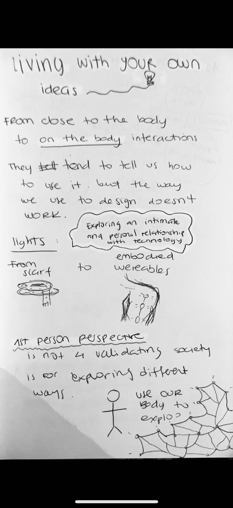
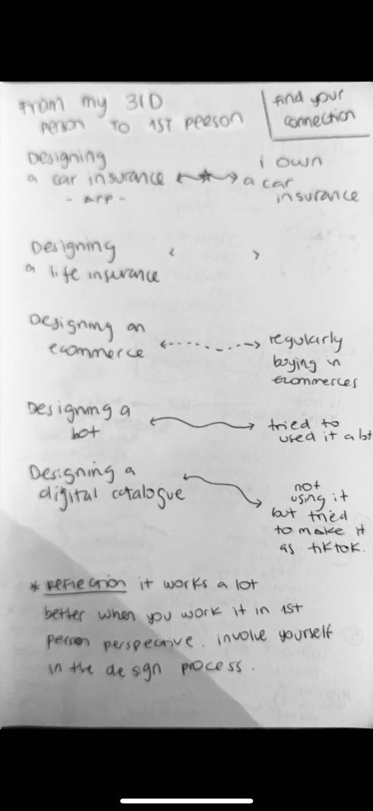
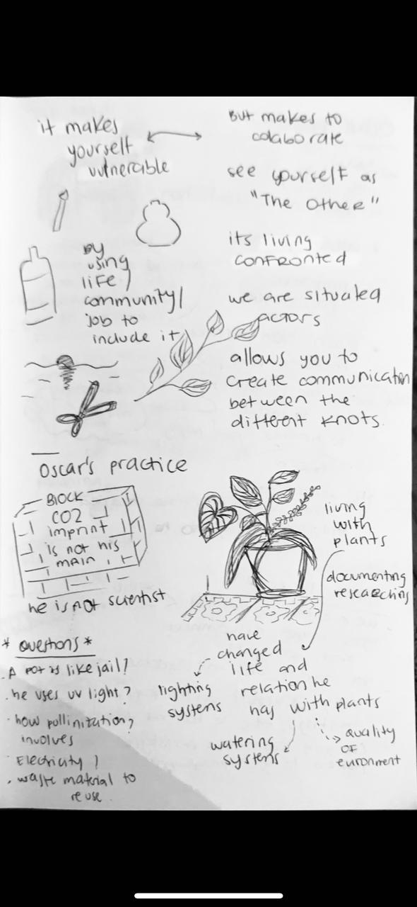
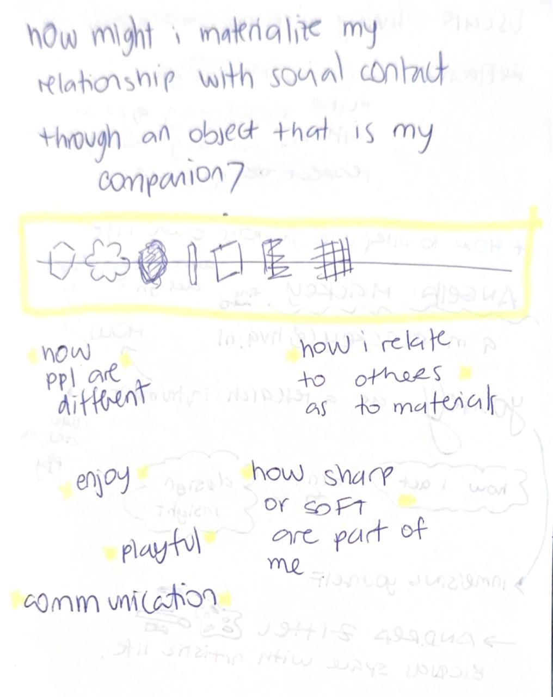
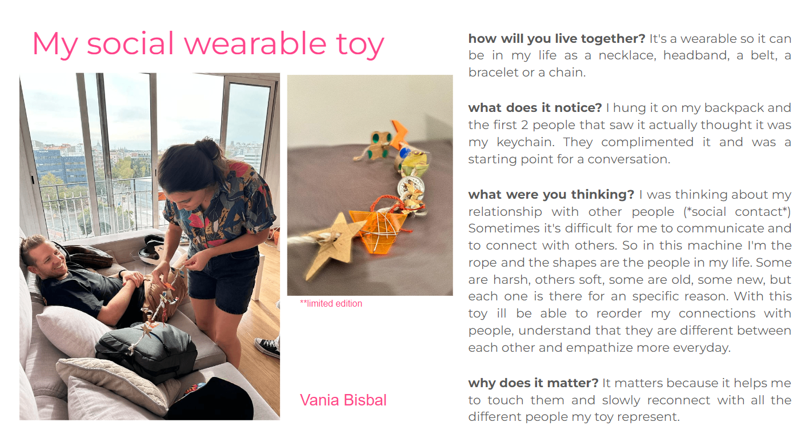

# Living with your own ideas

This seminar was about experiencing the design process from a 1st person perspective through a series of interventions within my life and Barcelona. 

Take a look to some of my notes of the seminar: 

<!--*add images and gifs here of the build process* -->
<!-- Markdown Content -->

  
  
  
  
  <!-- Add more images as needed -->

<!-- CSS Styles -->

The first intervention was creating a Lo-Fi protoype around: How might I materialize my relationship with a *social contact* (as the concept), through an object that is my companion? 

From concept to built protoype: 

# The second intervention
This was a design intervention with 1PP approach in relation to my area of interest.

<iframe src="https://player.vimeo.com/video/881484798?badge=0&amp;autopause=0&amp;quality_selector=1&amp;player_id=0&amp;app_id=58479" frameborder="0" allow="autoplay; fullscreen; picture-in-picture" style="position:absolute;top:0;left:0;width:100%;height:100%;" title="Living with your own ideas"></iframe>

**• What did you make? And why did it matter?**
 First-person perspective, entails stepping out of your comfort zone to immerse yourself as part of the research process. In my case, I decided to abstain from using Instagram, Google, and ChatGPT for 24 hours—platforms I typically rely on for inspiration and idea support.

Furthermore, I chose to document and repurpose my daily waste into art. This approach allows me to break away from my routine and draw inspiration solely from my daily waste and, of course, nature. My areas of interest encompass climate change, maker education, and art.

**• What happens when you involve yourself?**
When you involve yourself, you are actively taking part in the research, bringing the field or topic to life alongside you. This exposure leads to an increased engagement with the subject, prompting more questions and encouraging a different perspective through cohabitation. As a result, you may adopt new behaviors in response to this newfound understanding of the panorama.

**• What happens when you use yourself as an instrument?**
When you use yourself as an instrument, you undergo various feelings, thoughts, and questions. Initially, I found myself constantly reaching for my phone, attempting to access Instagram or Google something. However, as I let go, I began to feel more present in the moment, coexisting with the repurposing of my waste. I started contemplating what I could do with my waste, the types of waste I was generating, and their circularity. The presence of nature and outdoor spaces sparked new scenarios and artistic possibilities in my mind, providing inspiration.

**• Did anything change about your way of working?**
Definitely, I felt more inspired and motivated to work towards influencing and addressing topics related to climate change. It expanded my mindset to new boundaries.

**• What does it mean for your future work?**
I want to raise awareness about climate change and health topics in Latin America. Using my own waste made me reflect on my future work and learn that it is possible to actively cohabitate with your research space and thrive while conducting research. The first-person perspective (1PP) makes research more approachable, easier to do, and energizes the work. For me, it's challenging but inspirational to record my life.

**• After seeing the videos of your design space collective, how does it change your understanding of it, present new opportunities or inspire new possibilities for collaboration?**

Yes, videos provided inspiration for further interventions I can undertake personally. They also made me think about related fields and how two people can have a completely different approach to the same topic, fostering collaborations between them.
