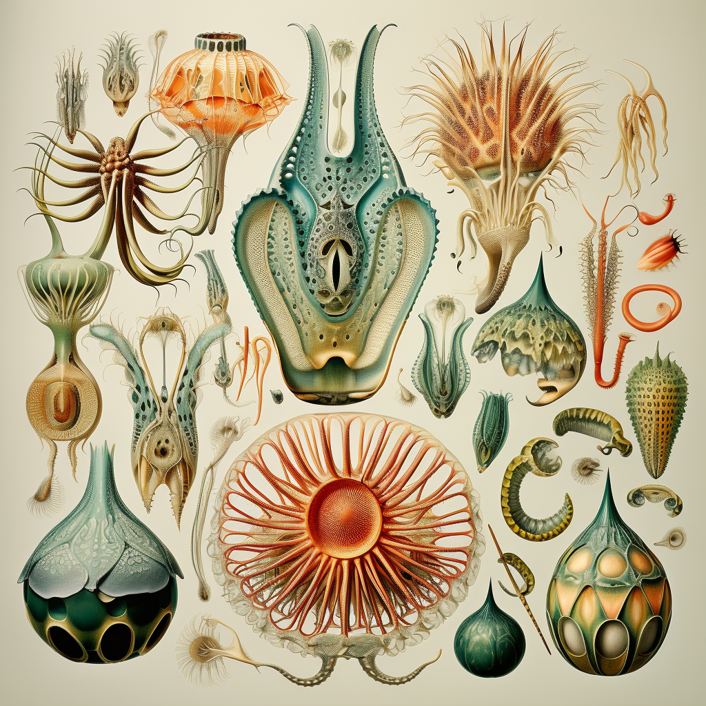
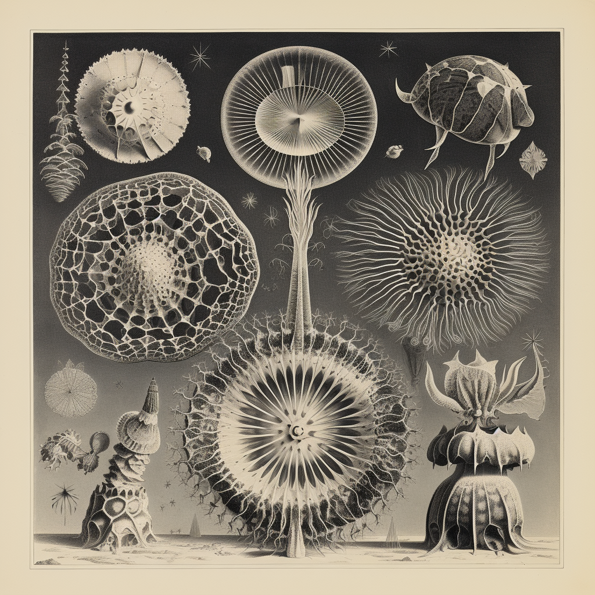
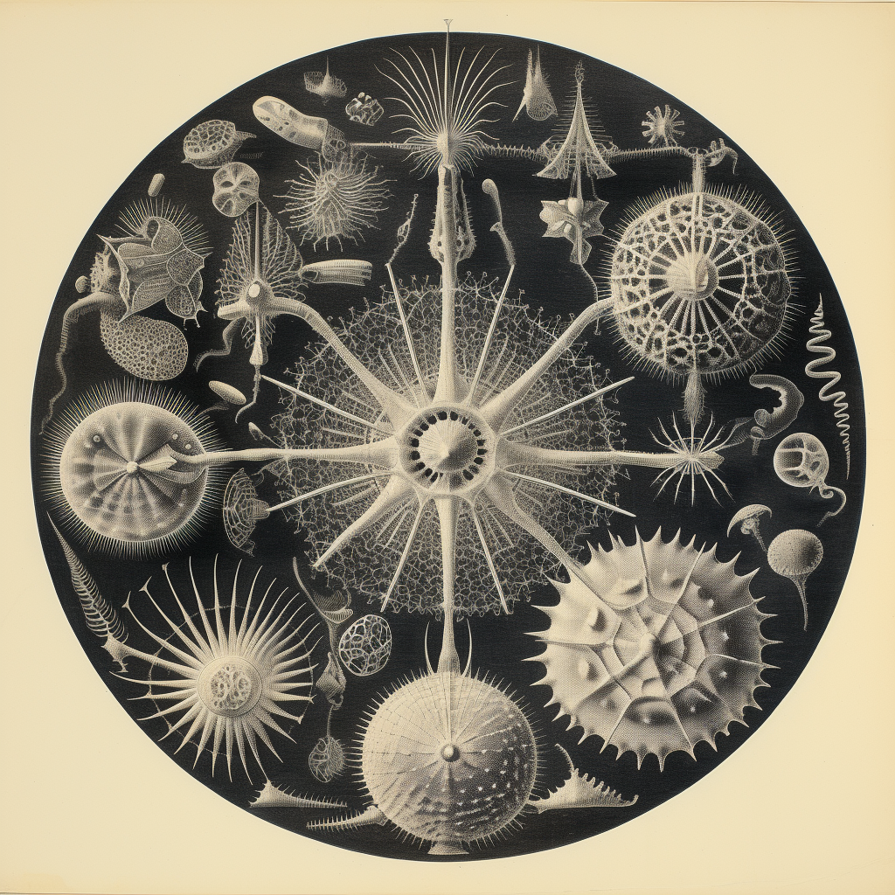
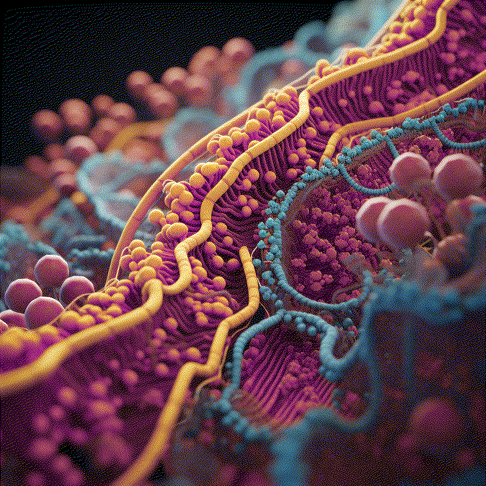

# Bio Zero

<!--*add images and gifs here of the build process* -->
<!-- Markdown Content -->

  
  
  
  
  <!-- Add more images as needed -->

<!-- CSS Styles -->

 **Iron-enriched potatoes**

 

This research aims to explore a genetically modified organism related to a problem aligning with my field of interest. I have chosen to investigate neuroplasticity and its associated challenges.

Neuroplasticity is a lifelong phenomenon occurring at all stages of life, with heightened significance during critical periods of development, particularly in early childhood. During this time, the brain is remarkably adaptable, and experiences can profoundly impact neural circuitry.

In infancy and early childhood, the brain undergoes rapid growth and development, representing a sensitive period when neural circuits are highly malleable, and the brain is particularly responsive to environmental stimuli. Nutrition plays a crucial role in supporting brain development and neuroplasticity, especially during the rapid growth of early childhood. This involves forming new connections and enhancing synaptic plasticity.

Several nutrients are essential for optimal brain function and the promotion of neuroplasticity. Here are some key nutrients and their roles:
Omega-3 Fatty Acids: Essential for the development and function of the brain, particularly docosahexaenoic acid (DHA). Commonly found in fatty fish, flaxseeds, chia seeds, and walnuts.
Iron: Critical for the development of myelin, a substance that insulates nerve fibers and facilitates efficient communication between neurons. Iron deficiency, especially during early childhood, can lead to cognitive deficits and impair neuroplasticity. Good sources include lean meats, beans, lentils, and fortified cereals.
Zinc: Involved in various neurochemical processes and essential for the formation and function of synapses. Found in meat, dairy products, nuts, and whole grains.
Vitamins B6, B9 (Folate), and B12: Important for the synthesis of neurotransmitters. Adequate levels support cognitive function and may influence neuroplasticity. Found in leafy green vegetables, legumes, poultry, fish, and fortified cereals.
Vitamin D: Linked to brain development and cognitive function. Obtained from sunlight exposure, fatty fish, fortified dairy products, and egg yolks.
Choline: A precursor to acetylcholine, a neurotransmitter important for memory and learning. Found in eggs, meat, fish, and certain plant-based sources like soybeans.
Protein: Essential for the synthesis of neurotransmitters and overall brain structure and function. Good sources include meat, poultry, fish, dairy products, beans, and legumes.

Within this array of nutrients, I have chosen to delve deeper into Iron. Iron deficiency anemia is a global issue affecting 2 billion people worldwide, particularly women and children [3]. One of my communities of interest is Latin America, specifically Peru, where anemia remains prevalent, especially in rural highland areas. Anemia poses a significant burden to smallholding farmers and their families.

In light of this, I am considering researching potatoes due to their widespread consumption and cost-effectiveness. Potatoes, the fourth most important crop in Latin America, are crucial in the Peruvian highlands, serving as a staple with daily consumption reaching 800 g and 200 g for women and children, respectively [5].
Moreover, it has recently been demonstrated that the bioaccessibility of iron in potato is 63 to 79%, significantly higher than that found in wheat, common bean, and pearl millet [2]. Bioaccessibility measures the percentage of iron that is released after in vitro gastrointestinal cell digestion (Caco-2) and is therefore available for intestinal absorption. Thus, although potatoes contain relatively low levels of iron and zinc, their high consumption rates and likely high bioavailability make them an excellent source of these minerals compared with cereal and legume crops [12].

Genes of Interest:
IRT1 (Iron-Regulated Transporter 1): Responsible for iron uptake from the soil.
FRO2 (Ferric Reduction Oxidase 2): Involved in the reduction of iron for uptake.
NAS (Nicotianamine Synthase): Facilitates the transport of iron within the plant.
YSL (Yellow Stripe-Like): Involved in the transport of iron within plant cells.

Genetic Modification Approach:
This research proposes a comprehensive genetic modification approach to enhance iron uptake in potatoes. The process initiates with the isolation of Genomic DNA from Arabidopsis thaliana, a plant naturally harboring the IRT1 gene responsible for iron uptake. Utilizing PCR Amplification, the IRT1 gene is selectively amplified from the genomic DNA using specific primers. To further augment the iron uptake capabilities, additional genes—FRO2 (Ferric Reduction Oxidase 2), NAS (Nicotianamine Synthase), and YSL (Yellow Stripe-Like)—are integrated into the genetic construct. These genes play crucial roles in the reduction of iron for uptake (FRO2), facilitation of iron transport within the plant (NAS), and transport of iron within plant cells (YSL). The next step involves the incorporation of these genes into the cloning vector. This vector, acting as a carrier, introduces the cluster of genes (IRT1, FRO2, NAS, YSL) into the potato organism.

Transformation Techniques:
I have researched two different technologies used in genetic engineering, serving distinct purposes in the process of introducing foreign genes into a host organism: CRISPR-Cas9 and Agrobacterium tumefaciens. Exploring both of them can lead us to different but more accurate results.

CRISPR-Cas9 Transformation Process:
Designing Guide RNAs (gRNAs): Design gRNAs that target specific locations in the potato genome where you want to introduce or modify genes (IRT1, FRO2, NAS, and YSL).
Cas9 Protein Production: Produce the Cas9 protein or use a pre-made Cas9 protein. This protein will act as molecular "scissors," cutting the DNA at the targeted location.
Delivery System: Develop a delivery system for the CRISPR-Cas9 components. This can involve creating plasmids that carry the Cas9 gene, along with the designed gRNAs.
Introduction into Potato Cells: Introduce the CRISPR-Cas9 components into potato cells. This can be done using various methods, such as Agrobacterium-mediated transformation or particle bombardment.
Genetic Modification: The Cas9 protein will create breaks in the potato genome at the locations specified by the gRNAs. The cell's natural repair machinery will then attempt to fix these breaks, potentially incorporating the desired genes (IRT1, FRO2, NAS, and YSL) or making modifications to existing genes.
Selection and Screening: Select transformed cells that have successfully incorporated the desired genetic modifications. Screening methods, such as PCR and sequencing, can be used to verify the presence of the inserted or modified genes.
Regeneration of Transgenic Plants: Regenerate whole plants from the modified cells. This involves growing plants from the transformed cells under controlled conditions.
Testing and Analysis: Evaluate the expression of the introduced genes in the transgenic plants.

Agrobacterium tumefaciens Transformation Process:
Selection of Genetic Material: The genes IRT1, FRO2, NAS, and YSL are chosen as the genetic material for introduction into the potato.
Construction of Binary Vector: These selected genes, along with their regulatory elements, are incorporated into a binary vector. This vector also contains a T-DNA segment for transfer to the potato.
Transformation of Agrobacterium: The binary vector, now carrying IRT1, FRO2, NAS, and YSL, is introduced into Agrobacterium tumefaciens through a suitable transformation method.
Culturing Agrobacterium: The transformed Agrobacterium is cultured to increase the population of cells. The binary vector replicates within the bacterium.
Induction of Virulence Genes: Environmental signals induce the virulence genes in Agrobacterium, triggering the transfer of T-DNA, carrying IRT1, FRO2, NAS, and YSL, to the potato host.
Cocultivation with Potato Cells: Potato tissues or cells are exposed to the Agrobacterium culture, facilitating the transfer of T-DNA into the potato cells.
Integration into Potato Genome: The transferred T-DNA, now containing IRT1, FRO2, NAS, and YSL, integrates into the potato genome at random sites.
Regeneration of Transgenic Potato Plants: Transformed potato cells are cultured to regenerate into whole plants. This involves selecting and regenerating potato plants that carry the introduced genes.
Screening and Confirmation: Transgenic potato plants are screened to identify those expressing IRT1, FRO2, NAS, and YSL. Molecular and phenotypic analyses confirm the successful incorporation of these genes.

Final Reflection 

Exploring genetics and iron metabolism has been very interesting. From studying neuroplasticity to understanding the intricacies of genes like IRT1, FRO2, NAS, and YSL, the journey uncovered the coolness of genetic modification. Learning the processes, from gene isolation to CRISPR-Cas9 and Agrobacterium-mediated transformations, revealed the precision and versatility of genetic tools.
This exploration goes beyond the lab, emphasizing ethical considerations and the need for rigorous testing when manipulating genetic information. It's not just science; it's a conscientious journey into the potential impact on ecosystems, agriculture, and human health. Considering the potential of iron-enriched potatoes in addressing nutritional challenges.

References

Amoros, W., Salas, E., Hualla, V., Burgos, G., De Boeck, B., Eyzaguirre, R., zum Felde, T., & Bonierbale, M. (2020). Heritability and genetic gains for iron and zinc concentration in diploid potato. Crop Science, 60(4), 1884–1896. https://doi.org/10.1002/csc2.20170
Andre, C. M., Evers, D., Ziebel, J., Guignard, C., Hausman, J.-F., Bonierbale, M., zum Felde, T., & Burgos, G. (2015). In vitro bioaccessibility and bioavailability of iron from potatoes with varying vitamin C, carotenoid, and phenolic concentrations. Journal of Agricultural and Food Chemistry, 63(41), 9012–9021. https://doi.org/10.1021/acs.jafc.5b02904
Bouis, H. (2018). Reducing mineral and vitamin deficiencies through biofortification: Progress under HarvestPlus. In World Review of Nutrition and Dietetics (pp. 112–122). S. Karger AG. http://dx.doi.org/10.1159/000484342
Bouis, H. E., & Saltzman, A. (2017). Improving nutrition through biofortification: A review of evidence from HarvestPlus, 2003 through 2016. Global Food Security, 12, 49–58. https://doi.org/10.1016/j.gfs.2017.01.009
Burgos, G., Liria, R., Zeder, C., Kroon, P. A., Hareau, G., Penny, M., Dainty, J., Al-Jaibaji, O., Boy, E., Mithen, R., Hurrell, R. F., Salas, E., zum Felde, T., Zimmermann, M. B., & Fairweather-Tait, S. (2023). Total Iron Absorbed from Iron-Biofortified Potatoes Is Higher than that from Nonbiofortified Potatoes: A Randomized Trial Using Stable Iron Isotopes in Women from the Peruvian Highlands. The Journal of Nutrition, 153(6), 1710–1717. https://doi.org/10.1016/j.tjnut.2023.04.010
Combining ability analysis for grain yield and quality characters in pearl millet [Cenchrus americanus (L.) Morrone]. (2023). ELECTRONIC JOURNAL OF PLANT BREEDING, 14(1). https://doi.org/10.37992/2023.1401.034
Connorton, J. M., & Balk, J. (2019). Iron biofortification of staple crops: Lessons and challenges in plant genetics. Plant and Cell Physiology, 60(7), 1447–1456. https://doi.org/10.1093/pcp/pcz079
de Haan, S., Burgos, G., Liria, R., Rodriguez, F., Creed-Kanashiro, H. M., & Bonierbale, M. (2019). The nutritional contribution of potato varietal diversity in Andean food systems: A case study. American Journal of Potato Research, 96(2), 151–163. https://doi.org/10.1007/s12230-018-09707-2
Finkelstein, J. L., Haas, J. D., & Mehta, S. (2017). Iron-biofortified staple food crops for improving iron status: A review of the current evidence. Current Opinion in Biotechnology, 44, 138–145. https://doi.org/10.1016/j.copbio.2017.01.003
Garg, M., Sharma, N., Sharma, S., Kapoor, P., Kumar, A., Chunduri, V., & Arora, P. (2018). Biofortified crops generated by breeding, agronomy, and transgenic approaches are improving lives of millions of people around the world. Frontiers in Nutrition, 5. https://doi.org/10.3389/fnut.2018.00012
INEI - Perú: Encuesta Demográfica y de Salud Familiar-ENDES 2021. (n.d.). [Interview]. Retrieved November 22, 2023, from https://www.inei.gob.pe/media/MenuRecursivo/publicaciones_digitales/Est/Lib1838/index.html
Narayanan, N., Beyene, G., Chauhan, R. D., Gaitán-Solis, E., Grusak, M. A., Taylor, N., & Anderson, P. (2015a). Overexpression of Arabidopsis VIT1 increases accumulation of iron in cassava roots and stems. Plant Science, 240, 170–181. https://doi.org/10.1016/j.plantsci.2015.09.007
Rehman, A. ur, Masood, S., Khan, N. U., Abbasi, M. E., Hussain, Z., & Ali, I. (2020). Molecular basis of Iron Biofortification in crop plants; A step towards sustainability. Plant Breeding, 140(1), 12–22. https://doi.org/10.1111/pbr.12886
Stein, A. J., Meenakshi, J. V., Qaim, M., Nestel, P., Sachdev, H. P. S., & Bhutta, Z. A. (2008). Potential impacts of iron biofortification in India. Social Science &amp; Medicine, 66(8), 1797–1808. https://doi.org/10.1016/j.socscimed.2008.01.006 
