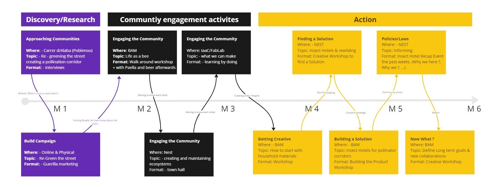

# Design with Others
Merkel and Adria from Holon this week facilitated a creative session with cooperative housing community. During the seminar, both “studio” and “field” concepts are reformulated in a design practice that happens within communities.

Rooted in participatory action-research principles, the course focused on alternative and circular strategies for local productivity with global connectivity. Inspired by the Distributed Design and CENTRINNO projects, it aligned with Fab City principles, emphasizing creativity to transform communities.

The seminar effectively met its objectives, providing insights into engagement principles, tools, and methodologies. Hands-on visits to local community projects in Poblenou enriched the learning experience, bridging theory and practice. The course not only broadened my understanding of social innovation but also instilled a sense of responsibility for positive change. Overall, it was a dynamic and impactful part of my educational journey.

The concepts soil and land were introductory so we could:
→ Define a conflict space we are interested / called to
→ Find community / communities struggling in that space
→ Explore intervention potential
→ Develop an approaching strategy

## Understanding wicked problems:
→ Wicked problems are at the root of many seemingly ‘simple’ problems we encounter at the level of our everyday lives (work, home, recreation, etc.) TD argues that solving for higher-level, wicked problems will have a trickle-down effect, solving for multiple problems simultaneously.
→ Wicked problems must be framed within radically large, spatio-temporal contexts from the distant past (to understand how the problem evolved) into the long-term future (what we want to transition toward).

## The Conflict Space
During our exploration in Sants, I discovered a conflict between nature and the neighborhood. Despite the presence of trees, they were confined to small spaces, and the area seemed designed to keep nature from interacting with the community. This lack of integration went unnoticed. In the Poblenou area, near IaaC, we identified a similar disconnect while mapping streets, where trees didn't establish a connection, and nature didn't feel like an integral part of the neighborhood.

## Find Communities Struggling
Identifying two communities, NestCityLab and BAM, we observed their strong connection with nature. BAM (Associaió Bioarquitectura Meditarrànea) is a community garden with sustainables practictioners and  NestCityLab is a green building for collaborating spaces with an internal garden to conserve  the industrial heritage  and to restore natural biodiversity. Despite being just four blocks away, there is no collaboration between them, and their sustainable green areas within their premises lack integration. The streets also pose challenges for pollinators to move across blocks. Consequently, the bee community is struggling to pollinate across the entire area.

## Explore Intervention Potential
To address this issue, we considered approaching these communities (Bauma & Nest City Lab) to understand their values and goals. We aimed to explore if they had ever considered connecting with and assisting Poblenou neighbors in integrating nature into the area. Our initiative sought to invite them to be part of this endeavor and raise awareness about pollination, emphasizing its significance beyond private spaces. Additionally, the intervention aimed to promote biodiversity on a specific street in Poblenou, creating a green corridor where pollinating species could live within the city. 
The Plan:

## First Approach Strategy
As an initial step in our strategy, we designed posters to raise awareness about pollination and planned how to engage the entire neighborhood. 

To gain a deeper understanding of the issue, we even dressed as bees, symbolically experiencing their struggle. We traversed the neighborhood, searching for flowers and pathways for pollination. In our planned this experienced could be accomplished by kids or whoever wants to get involved in a workshop "Be a Bee" to include families of the zone. 
Take a look to the video:
<iframe width="560" height="315" src="https://www.youtube.com/embed/FUPg-zJ5T0o?si=ihNQYXzo-WeVbDbw" title="YouTube video player" frameborder="0" allow="accelerometer; autoplay; clipboard-write; encrypted-media; gyroscope; picture-in-picture; web-share" allowfullscreen></iframe>

## Final Reflection
This seminar changed my approach to community design, emphasizing active engagement and sustained involvement beyond the traditional designer-community relationship. It opened my eyes to the often-overlooked issues within cities, prompting a reevaluation of Barcelona's exclusive focus on human needs. The importance of understanding communities, mapping intentions, and considering long-term impacts became clear, challenging me to craft solutions with a broader perspective. Overall, the seminar has transformed my outlook, urging me to actively participate alongside communities, fostering a more thoughtful and inclusive approach to problem-solving.

## Resources: 
https://www.apocapocbcn.com/about
Sandra Martin Lara: fundadora de slowup, apuesta por la arquitectura natural y generativa, por la cooperación y la ayuda mutua. 
La Borda: http://www.laborda.coop/es/
Societat Organica: embracing sustainability paradigm in the building sector, closing the loop on material flows as a necessary condition to achieve sustainability https://societatorganica.com/en/
Oik: https://oik.ninja/red
