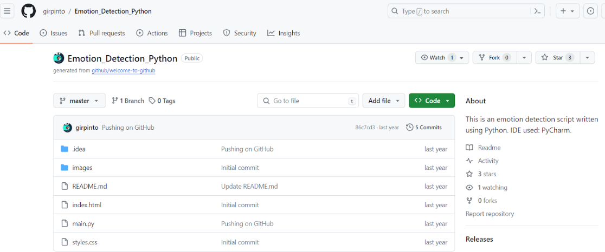
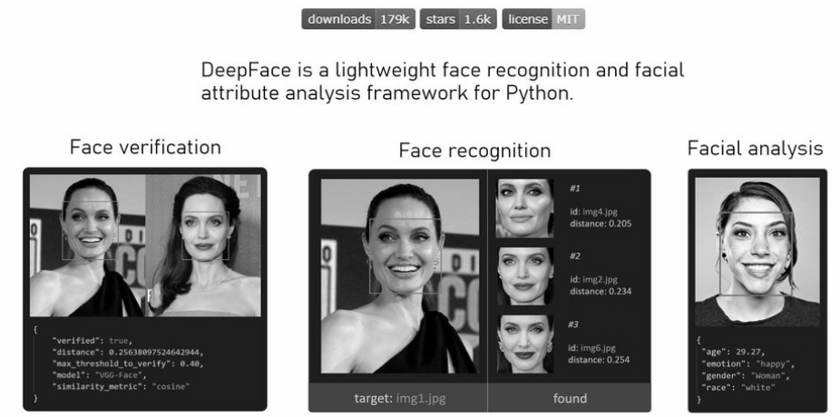
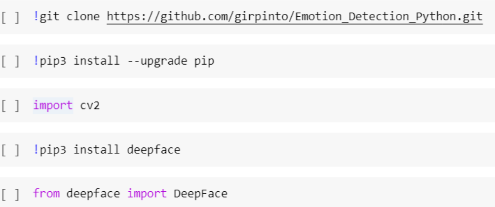
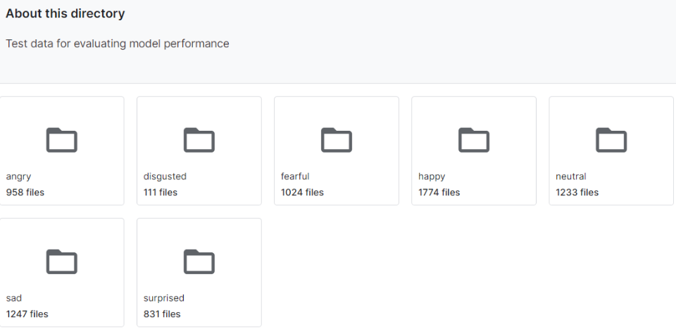
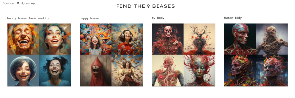
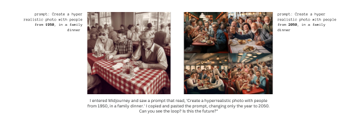
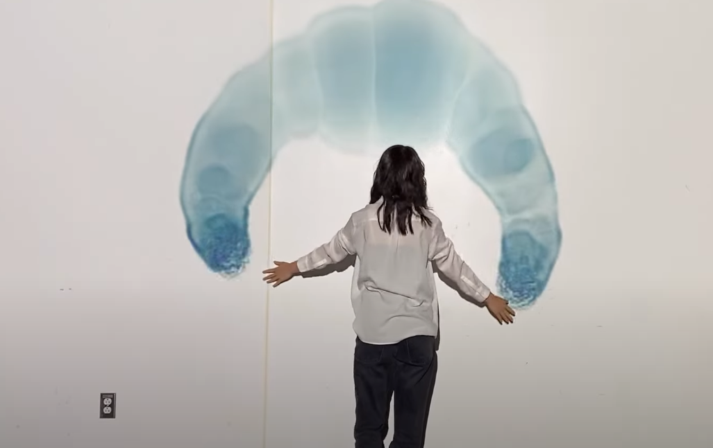

# The Love Hacker 
This project aims to explore AI tools and suggest a solution for a current real-life problem. As a team, we were interested in topics related to body, real vs. online identity, human behaviors, and surveillance. Consequently, we decided to look into emotion detection and facial recognition models.  

<iframe src="https://docs.google.com/presentation/d/e/2PACX-1vRD9WDvoTS1BrJmd0OyvAHZsvP1acctGxPmzgGv-jfi-7e78WntqeyE_NeJeLx8R5W89SVjaLAWC2Aj/embed?start=true&loop=false&delayms=3000" frameborder="0" width="960" height="569" allowfullscreen="true" mozallowfullscreen="true" webkitallowfullscreen="true"></iframe>

**How it started?**
In the initial stages, we brainstormed various proposals where facial recognition or emotion detection could be useful. Some of our ideas included a lie detector, assistance for helping visually impaired individuals identify emotions, an emotion collector integrated into a product, and utilizing emotions to detect mental health issues. However, after careful consideration, we opted to explore the potential of AI for futuristic human romantic interactions: specifically, how we could use a flirt detector to help people find love.

**The value proposition statement:**
Using emotion detection
to detect flirty behaviours,
we can help people 
with a more efficient way to understand when people are flirting
in face to face settings
so that they find love easily

**How we chose the model?**
We explored Kaggle, Huggingface, Reflect to find models or APIs relevant to our project. Eventually, we stumbled upon a model created by an Italian developer on GitHub who utilizes DeepFace and OpenCV to construct an emotion detection model specifically designed for computer vision.

DeepFace is a deep learning facial recognition system created by a research group at Facebook. It identifies human faces in digital images. The program employs a nine-layer neural network with over 120 million connection weights and was trained on four million images uploaded by Facebook users. It has 98% accuracy, which is more than the human eye. 

OpenCV is a large open-source library for computer vision, machine learning, and image processing and now it plays a major role for real-time operations in today’s AI systems.

**Our First Attempt: GitHub**
As we dove into the GitHub model to integrate it into our project, we realized it required us to enable the use of the webcam for real-time videos. As we were working with Google Colab, we could not open our own cameras as it operates on a distant hosting network, not on our computer. We therefore had to adapt the code given on GitHub with Pau and Marc’s help, to have the AI detect emotions on videos that we would upload to the hosting network ourselves. We however acknowledged that in a subsequent exploration, we could experiment with real-life videos.

**Coding process with Google Colab:**
Coding this system on Google Colab required us to clone the GitHub repository and install both the DeepFace and OpenCV libraries. 

We then coded the model to recognise faces and put a frame around faces on videos. At first, the system was recognising faces in objects, so with Marc’s help, we refined the code for the face recognition mechanism to be more precise. 

Once that was done, we had to cut videos as they were going to be processed for too long: the emotion recognition system was analyzing 60 frames per second.

The second part of the code was using commands to recognise emotions in these frames. However, when running that part of the code, the faces were being recognised and framed in the videos but the emotions were not being labeled. This was because our model was not finding emotions, but Marc helped us fix that. 

The model was an emotion recognition tool, which means it detected many emotions through the DeepFace library: anger, happiness, sadness, surprise, disgust, fear and neutral. As love wasn’t part of the available emotions, we decided to treat happiness as love for the purpose of our project and label it as such in the code. We then asked the AI to only label emotions on the video when the dominant emotion was happiness. 

**Other datasets we could have used:**
We found a model that was already trained with a dataset of pictures from Facebook users. However, if this wouldn’t have been the case, we could have used this dataset to train a relevant neural network. The dataset contains 35,685 examples of 48x48 pixel gray scale images of faces divided into train and test dataset. Images are categorized based on the emotion shown in the facial expressions (happiness, neutral, sadness, anger, surprise, disgust, fear).

**Video Trials**
We first experimented with videos of ourselves and then downloaded videos from the internet. There is evident bias in our results considering that happiness was changed to love for the purposes of our project.

**Purposes**
It's important to note that the idea of a love detector is more fictional or based on pseudoscience rather than a well-established scientific concept, although academic research on the body language of love exists.
A love detector might be used as a novelty or entertainment device for events, parties, or amusement parks. People may find it fun to use such a device even if it doesn't have any real scientific basis. Artists or creators may use the concept of a love detector as part of their projects, whether in movies, literature, or interactive installations. This could be especially useful in art installations willing to trigger reflection on our understanding of emotions and relationship to them, and how AI might perceive them. Companies may use the idea of a love detector in marketing campaigns to promote products or services related to relationships and romance, such as dating apps. In a more serious context, a hypothetical love detector might be used in relationship counseling or therapy to facilitate discussions about emotions and communication. Researchers in fields such as psychology or human-computer interaction might explore the concept of a love detector for academic purposes, although such exploration would need to be grounded in rigorous scientific methodology.
More widely, an emotion detector could have more impactful uses, such as helping visually impaired individuals with sensing emotions, if these are translated into sounds through Arduino, for example. This could also help neurodivergent individuals understand people’s emotions better.

**Ethics and bias:**
- Surveillance and Privacy Concerns: A love detector that involves monitoring and interpreting personal interactions may raise concerns about invasion of privacy. Individuals may not consent to having their emotions and flirting behaviors analyzed, especially in private or intimate settings. The use of such technology without clear consent could lead to violations of privacy rights.
- Accuracy Challenges: Emotions, especially those related to love and attraction, are intricate and can vary widely among individuals. AI systems may struggle to accurately interpret the subtleties and nuances of human emotions. Misinterpretation can lead to false conclusions, causing misunderstandings and potential harm to relationships.
- Subjectivity and Cultural Sensitivity: Flirting and expressions of affection are strongly influenced by cultural norms and practices. An AI system trained on data from one cultural context may not accurately interpret or recognize behaviors from another culture. This can introduce biases and inaccuracies in the system's assessments. Thorough training and consideration of cultural diversity are essential to mitigate this issue.
- Emotional Nuances: Relationships involve a myriad of emotional nuances that extend beyond observable behaviors. Human connection is complex and may involve non-verbal cues, shared experiences, and emotional intelligence that AI lacks. Relying solely on AI may oversimplify the rich and multifaceted nature of human relationships.
- Unintended Consequences: Introducing AI for relationship-related surveillance may inadvertently shape societal norms and expectations. Individuals may alter their behavior or interactions knowing they are being monitored, potentially leading to a distortion of natural romantic dynamics. This could impact social trust and the authenticity of human connections.

**Personal Reflection**
Doing this speculative project was super fun and really interesting. Even though we brainstormed different topics and conflicts we wanted to address for this project, in the end, we decided to do something fun: a love detector, and it turned out to be the best idea.

It was "the best idea" in the sense that we were highly engaged with the different outcomes we could have out of this "love detector"; therefore, we managed to pull closer a "difficult" tool, as AI was for us, with a fun and speculative approach to make the process easier.

Being introduced to the open source of datasets and models is amazing (Kaggle, Hugging Face, Reflect, Colab, etc.). Having all of these available and easy to use is a new skill I definitely want to explore. Personally, I've been paying for Midjourney for the past few months because I'm really into generating speculative imaginary scenarios; here are some examples:

And during these days, I have already been exploring some text-to-image models that are much more interesting than Midjourney. However, as I try different models that can do the same thing, I become more aware of the biases that AI has. Here are some examples:
  

In that way, if this happens with image-to-text models where you can visually see the errors, it raises warnings for the biases of other models that are less tangible.

Furthermore, due to this AI project, "love hacker," I modified the code so that I could have an emotion detector with my webcam.
Take a look to the code: 

import cv2
from deepface import DeepFace

face_cascade = cv2.CascadeClassifier(cv2.data.haarcascades + "haarcascade_frontalface_default.xml")

video = cv2.VideoCapture(0, cv2.CAP_DSHOW)

if not video.isOpened():
    raise IOError("Cannot open webcam")

while video.isOpened():
    _, frame = video.read()

    gray = cv2.cvtColor(frame, cv2.COLOR_BGR2GRAY)
    face = face_cascade.detectMultiScale(gray, scaleFactor=1.1, minNeighbors=5)

    for x, y, w, h in face:
        image = cv2.rectangle(frame, (x, y), (x + w, y + h), (89, 2, 236), 1)
        try:
            # analyze = DeepFace.analyze(frame[x:x+w, y:y+h], actions=['emotion'])[0]
            analyze = DeepFace.analyze(frame, actions=['emotion'])[0]
            region = analyze['region']
            print(analyze['dominant_emotion'])
            image = cv2.rectangle(frame, (region['x'], region['y']),
                                  (region['x'] + region['w'], region['y'] + region['h']), (89, 2, 236), 1)
            cv2.putText(image, analyze['dominant_emotion'], (region['x'], region['y']), cv2.FONT_HERSHEY_SIMPLEX, 1, (224, 77, 176),2)

            #if analyze['dominant_emotion'] == 'happy':  # delete this if you want to see all emotions, this will only print when the dominant emotion is happy
                #cv2.putText(image, 'love', (region['x'], region['y']), cv2.FONT_HERSHEY_SIMPLEX, 1, (224, 77, 176),
                         #   2)  # this labels happy as love but if you want to see all emotions replace with cv2.putText(image, analyze['dominant_emotion'], (x, y), cv2.FONT_HERSHEY_SIMPLEX, 1, (224, 77, 176), 2)
        except:
            print('no face')
    cv2.imshow('video', frame)
    key = cv2.waitKey(1)
    if key == ord('q'):
        break

video.release()
cv2.destroyAllWindows()

 With this tool, I believe I can use it for various purposes, but the first one was trying to connect Python with TouchDesigner to generate a visual flow of the resultant emotions. Im still struggling about how to connect Python with Touchdesigner because the TD library is not in Python, but i will explore some external ones. The expected result is that with the format of an art installation, the visuals flow regarding the facial expressions of the user. 
 

