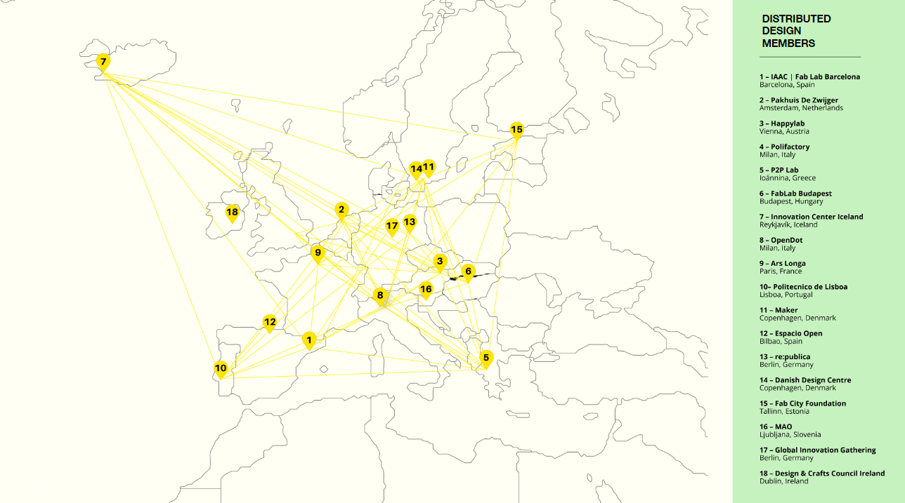

# Future Talks

Future Talks is a series of conversations with friends of ELISAVA and Fab Lab Barcelona, exploring the nature of emerging futures from the past to the present and beyond.

## About the Distributed Design Platform:
Emerging at the intersection of the Maker Movement and design sensibility, Distributed Design provides a framework for designers, makers and creatives to innovate the field of design towards more sustainable, open, inclusive and collaborative practices. It is a proactive response for makers and designs to prefigure viable design alternatives to the current paradigm designed for mass consumption.

From...  To... 

## Where?

Check out the Distributed Design documentary:
<iframe width="560" height="315" src="https://www.youtube.com/embed/lUJJtdFGyrc?si=LRjz-n8rPMRP_aWt" title="YouTube video player" frameborder="0" allow="accelerometer; autoplay; clipboard-write; encrypted-media; gyroscope; picture-in-picture; web-share" allowfullscreen></iframe>

And a masterclass of Other Class:
<iframe width="560" height="315" src="https://www.youtube.com/embed/2pNhwKDWVy8?si=g8-25mBgnwOdYH1p" title="YouTube video player" frameborder="0" allow="accelerometer; autoplay; clipboard-write; encrypted-media; gyroscope; picture-in-picture; web-share" allowfullscreen></iframe>

The Reflection Tree is a tool to reflect about the distributed values of your project https://miro.com/app/board/uXjVN8fPjco=/

My Reflection Tree

My key takeaways of the seminar
1. Shifting the mindset, from linear to spiral in production ecosystem
2. Designing with value can be done and there is a collective of creatives and institutions supporting it.
3. Using the reflection tree tool is a very useful way to understand where is your project in term of designing with values, and points out specific directions in which you would have opportunities to explore. 

This seminar opened my mind to a new framework of design. Even though I was already aware of the importance of conscious design, the revelation that there is a structured framework to test projects and understand their position has proven to be highly valuable. I decided to create a reflection tree specifically for my AI image generation practice, even though it's pursued purely for fun. This exercise prompted me to contemplate alternative approaches because a significant portion of my scores were consistently low or almost zero. It's sometimes surprising to realize that even in fun and random design practices, there is the potential to add value.

