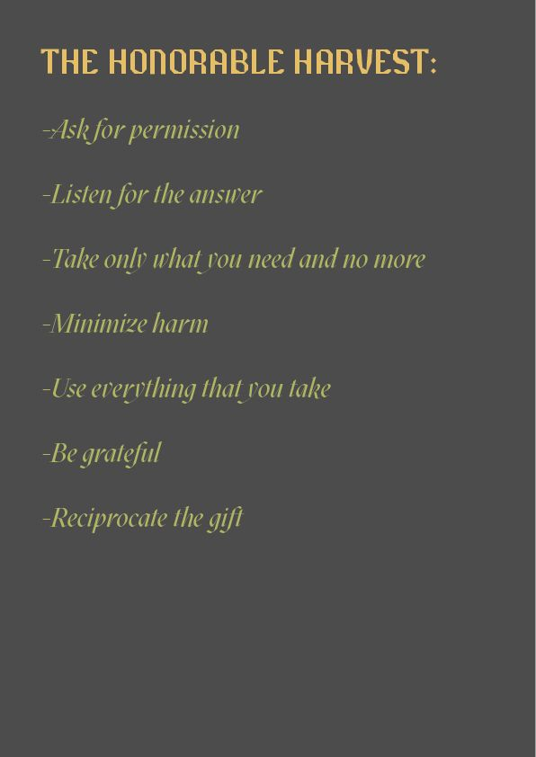
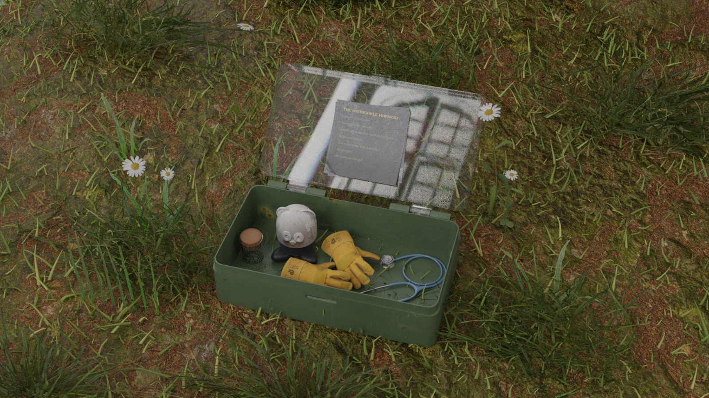

# Futures Fair
Future Talks is a series of conversations with friends of ELISAVA and Fab Lab Barcelona, exploring the nature of emerging futures from the past to the present and beyond.

In this seminar, we collaborated with the School of Digital Arts at Manchester Metropolitan University to deep dive into talks about Blockchain, NFTs, and DAOs. We explored different ways of developping a governance model around a context we would be interested to solve through a collaborative proposal. 

## Project
Check the miro: https://miro.com/app/board/uXjVN75_Ou4=/

In this project we addresed our concern about the loss of biodiversity, specially in cities. We proposed the creation of a DAO to collaboratively encourage people to live more concsious about our daily life decisions and how these affect biodiversity when you trace them. This DAO is a macoscale proposal for the problem but we also defined a microscale prototype: a kit for preserving biodiversity at home. 

## Context: 
Even though loss of biodiversity is part of the cycle of life of living organisms its alarming how the anthropocence culture keeps increasing the ways of harming and finishing with biodiversity. 
We brainstormed around different ideas to give agency to living organisms that cannot speak and do not have their own rights to exist.

We discussed about ideas like: 
- Helping trees communicate when they are dying, using their roots connections. 
- Raising awareness about the loss of diversity through a humanized funeral or ritual.
- The use of AI to protect the biodiversity. 

## Honorable Harvest 

## Governance Model 
For the governance model we used the Honorable Harvest to inspire us and reflect on how it could change our mindset if we really cared and asked permission to animals and plants instead of just taking them for granted. Each line of this this "manifesto" can be taken to the city and be used to improve our relationship with living organisms, and in the end restore this situation. In this way we proposed some community rules to govern our DAO. 

## The Kit 
We have normalized cities with buildings that exclude biodiversity. The use of public or private transportations made from materials we dont know. Staying indoors while disconnecting from our relationship with biodiversity. 
We are proposing a Kit to help us reconnect with nature at home. This Kit contains different gardening tools made to treat your plant as the MANIFESTO proposes and to reflect during your practice. Reflection will influence daily decisions and others.
 

----
Building this project made me understand how DAOs can be built and work. It also made me reflect and think about the chosen topic and how a collabotative effort might be really helpful for emerging futures. Even though I already knew how NFTs and blockchain work, this seminar helped me to discover other ways to value NFTs than just digital art. 

