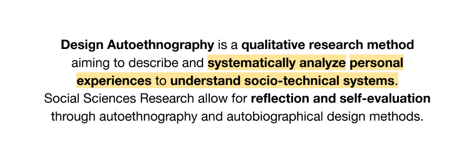
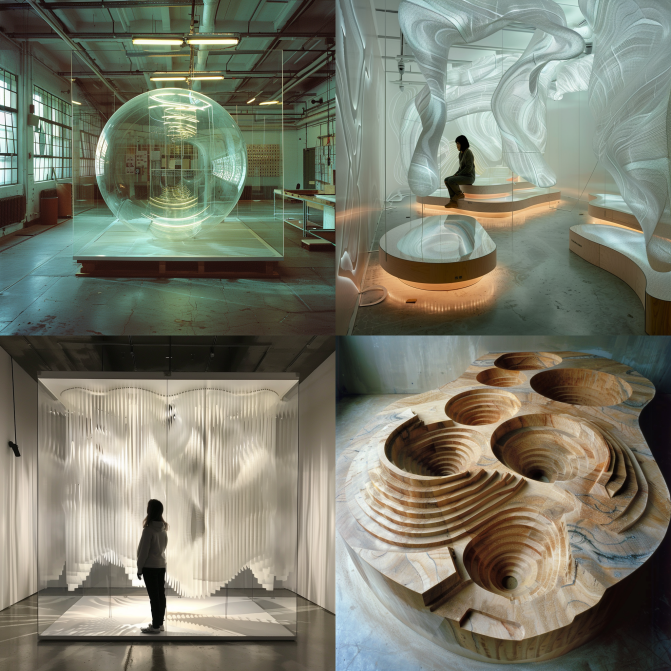
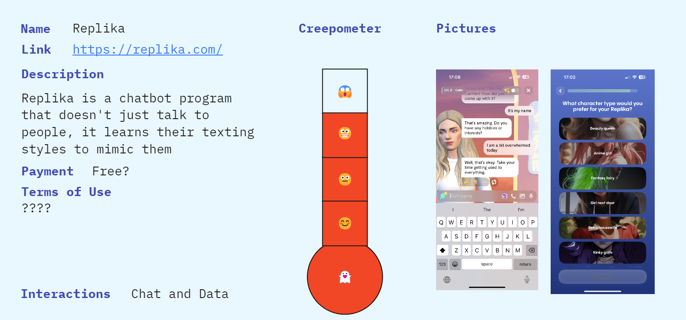

# Design Studio 02

## Autoethnography, Alternative Presents & Ways of Drifting

 

In this course, we've explored Design Autoethnography, a qualitative research method focused on analyzing personal experiences within socio-technical systems. I've reflected on my own narrative through autoethnography, recognizing the importance of self-reflexive activation in infusing the design process with principles like responsibility, accountability, transparency, empathy, and positionality. This course has equipped me to navigate a transformative design process, allowing me to craft a personal vision for designing in the unknown, with a deeper understanding and empathy. It's been a journey of growth, integrating my experiences into my approach to creative problem-solving.

# Alternative Presents
 

Exploring alternative presents is not just about envisioning different futures; it's about understanding our overarching narratives and making sense of the paths we're forging through collective design interventions. These alternative presents provide designers with the opportunity to unlock escape routes from present continuities, offering a space to boldly imagine and explore discontinuities. By doing so, we can envision more optimistic future scenarios, diverging from the narrow outcomes presented by our current business-as-usual practices. It's through this exploration of alternative presents that we can actively shape for a more innovative and hopeful tomorrow.

# Some projects 
https://en.goteo.org/project/smart-citizen-sensores-ciudadanos
http://making-sense.eu/cabbage-soil-smart-citizen-kits-sensing-environments/

# Thinking it towards my narrative 
 

# Ways of Drifting

 
<figcaption>Prompt: Ways of Drifting: Five Methods of Experimentation in Research Through Design</figcaption>

# 1st intervention: What makes us humans? 

# Are we ready to trust technology more than ourselves?
 

We began this project with a big goal: to make an AI that felt like a part of us, understanding and helping us in first person perspective. We were excited by the idea of an AI that could show us more about ourselves, like holding up a mirror to our thoughts and feelings. We knew all the data it can handle and the conclusions algorithms can do about ourselves. So we wanted this AI to be more than just a tool; we hoped it could become a friend who knows us well.

At first, we wanted to do a digital clone of ourselveves to be able to compare and contrast its answers with our and test how reliable or close to reality it is. But we quickly saw that the options available for coding it fast (open source) weren't enough. They asked for a lot of our personal info and it didn't feel safe. We realized that if we wanted something truly ours, we'd have to make it ourselves. 

So, we changed our plan. Instead of just looking for the perfect tool that can clone us, we decided to learn as much as we could about all the different AI stuff out there. We used a Miro board to keep track of everything—like a big digital notebook. It helped us organize our thoughts and plans, showing us all the cool ways AI could be part of our lives. This board became our project's heart, take a look [here](https://miro.com/app/board/uXjVNzLbN80=/).

# About the intervention

Returning to our early thoughts about whether to trust technology, more than ourselves, or not; sparked a deep dive into the nature of human versus AI identity. We wandered if people could really see the difference between the two. This curiosity led us to an experiment where participants had to distinguish between AI-created and human-made content. We used AI to produce images, texts, and sounds, compiling them into a survey. The tools at our disposal were ChatGPT for text, Dall-E for images, and a Google Collab project for generating voices.

Access the form [here](https://app.voiceform.com/to/KewddITIqUutaTI7).

# Findings & Reflection

After gathering responses from about 30 participants, we were struck by a fascinating observation: most were unable to differentiate between the outputs of humans and AI. When pressed for their reasoning, the majority remarked that the AI-generated content seemed "too perfect," which was why they pegged it as not human-made.

Are we able to differentiate technology and human creativity? It was surprising to see how many participants couldn't differentiate between the two, often citing the "perfection" of AI as a giveaway. This outcome not only highlights AI's ability to mimic human creativity closely but also forces us to question what distinguishes human intelligence and creativity from artificial intelligence.

 It underscores an essential truth about the uniqueness of human expression, characterized by our imperfections and emotional depth—qualities that AI cannot replicate. However, the findings also serve as a cautionary tale about the increasing reliance on technology, reminding us to value and preserve the irreplaceable elements of human creativity and individuality. As AI continues to blend more seamlessly into our lives it scares me and makes future more creepy, so let's see what we I can do about it. 

 ## 2nd intervention: life off devices 

In my second intervention, I expanded on the idea of physical technology and hardware. After creating an AI hologram for the microchallenge, I was motivated to explore further during design dialogues by asking people about their visions for the future of hardware. My interest was piqued by feelings of technological fatigue and a concern that the material aspects of our devices might be alienating us from our natural existence. I was eager to hear others' thoughts on this.

Pictureeeeeeeeeeee

This sparked a series of engaging discussions and reflections. Initially, I questioned why my focus was solely on hardware when in reality, hardware serves as a conduit for software. This insight led me to reconsider our future interactions with software. Furthermore, these conversations touched on the concept of design fiction and how our expectations of a high-tech future are often influenced by the media. This encouraged me to think more deeply about our complex relationship with technology and the speculative limits that this relationship might push us towards.

Picture of interacctionnnnn

I strongly feel that the role of nature is being overlooked in the technology development process. Considering technology's significant role in our daily lives, it's critical to rethink our engagement with devices, the chase for high-tech advancements, and finding a balance between work and life. There's much more to explore on this topic, but I'll stop here. To foster more thought-provoking discussions within the Design Dialogues, I'm also sharing some AI-generated images that helped steer our conversations. 

