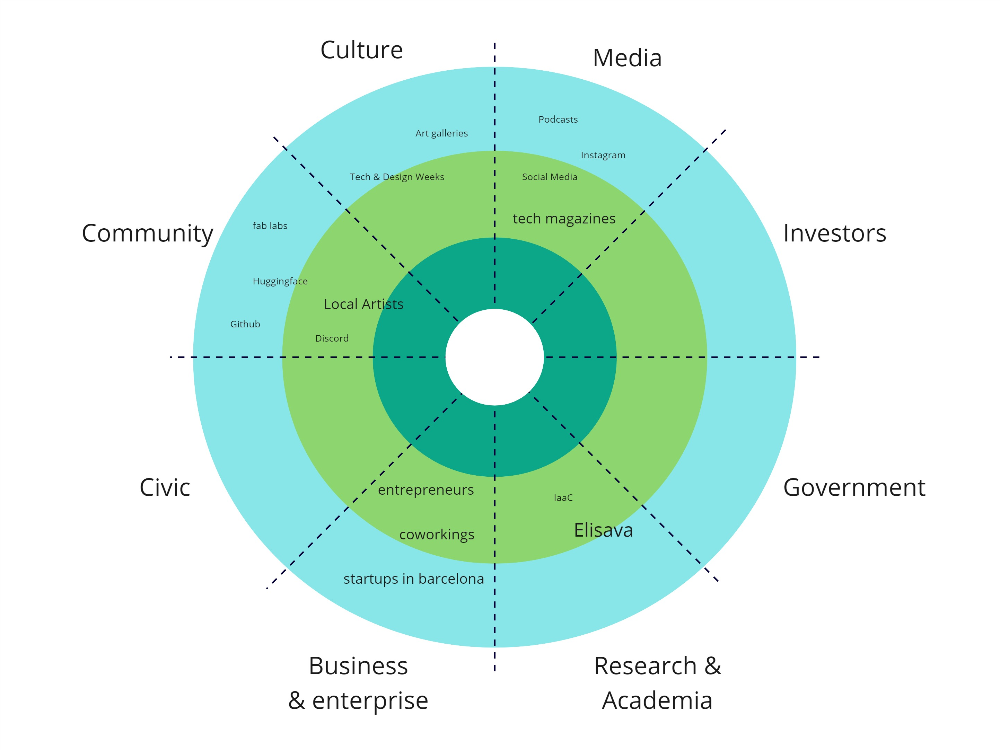
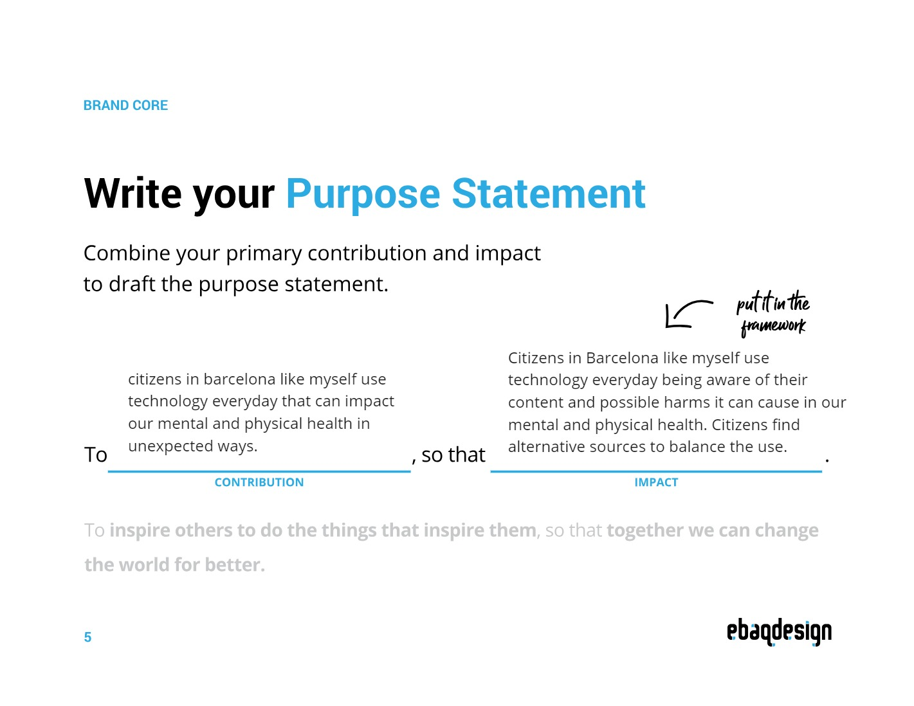
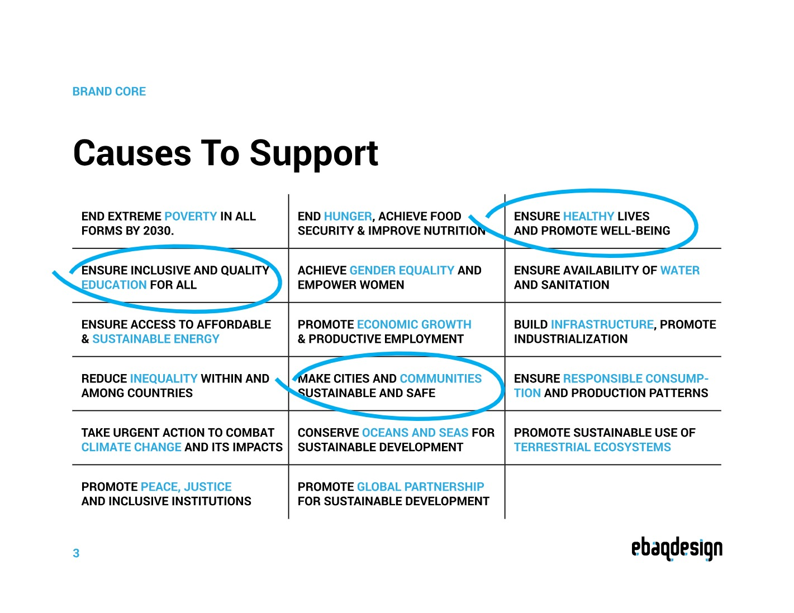
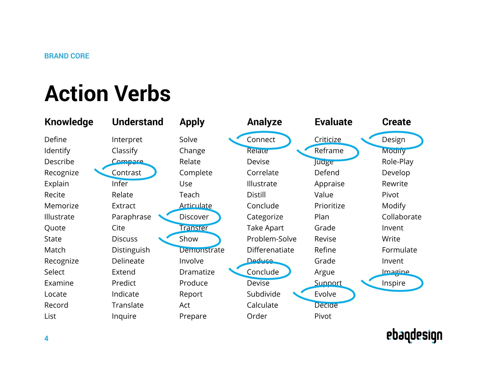
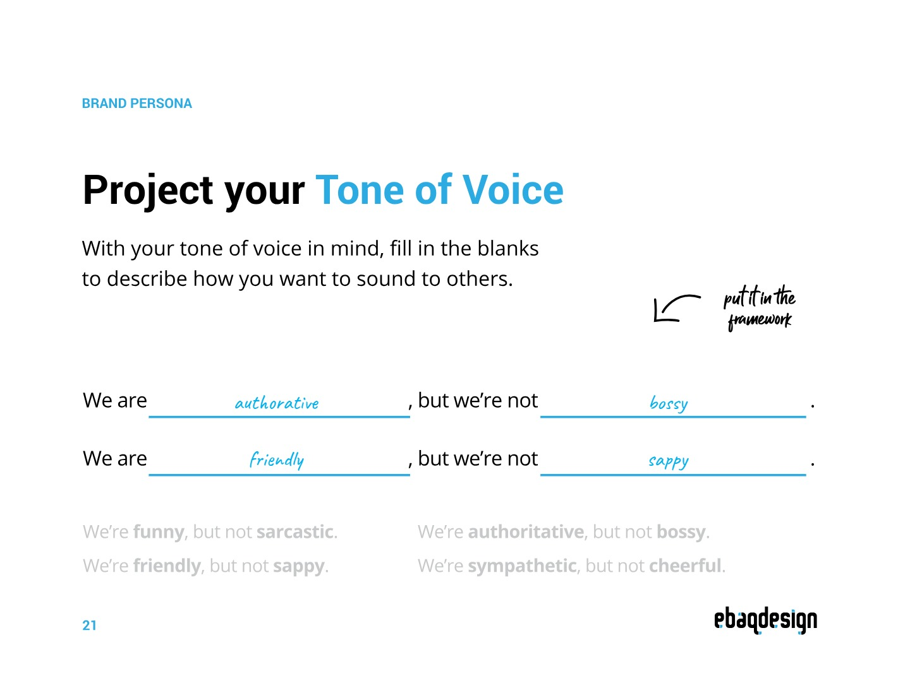
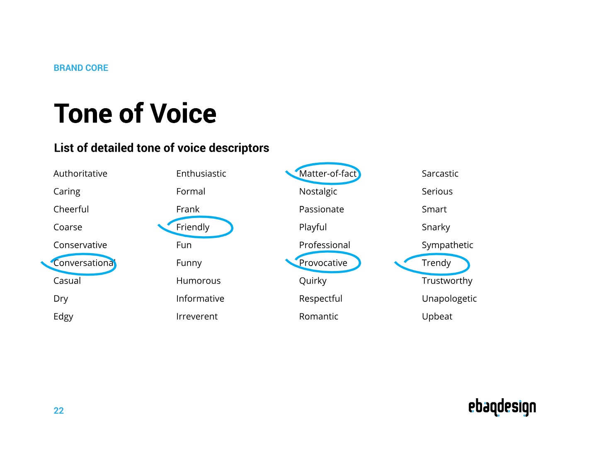
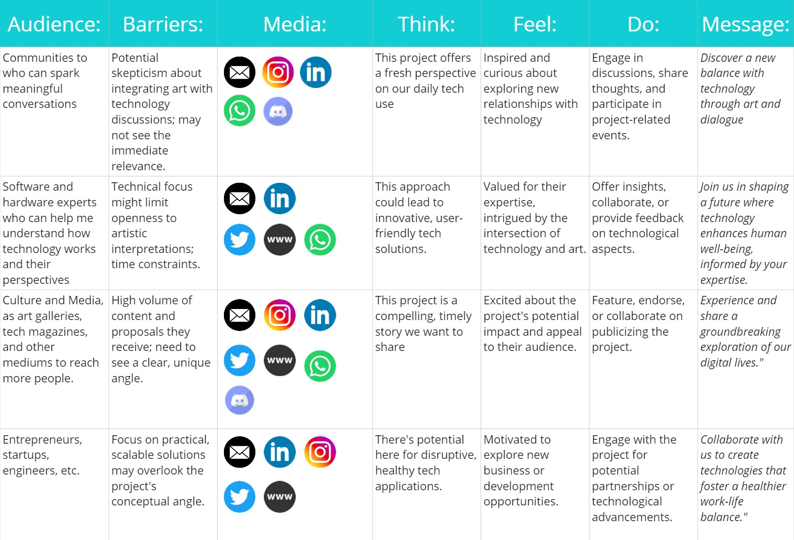

# Storytelling
## Week 1 - the importance of telling a story
 

# The Golden Circle 
 

*Why*

  
 I aim to positively impact the future of our work by exploring how we interact with technology (hardware and software today) and the consequences of technological fatigue. I'm also keen on understanding the influence of remote working on our professional lives. My goal is to contribute to a future where technology meets well-being in balanced ways. And probably introducing nature to the experience. 

*How*  
I plan to change the way we think about and use technology by introducing new experiences. By using art installations and visual projections, I want to raise conversations about the influence of tech in our lives. And explore hoe we can find less exhausting ways to work, study, or research with immersive experiences. These experiences are meant to make people think about their tech habits and imagine a future where technology supports us in healthier ways.

*What*  
My project is about creating engaging, immersive experiences that challenge the way we interact with technology. Through art and visuals, I'll present alternatives that encourage us to reflect on our tech use. The aim is to spark discussions and thoughts about how we can use technology in a way that's beneficial and balanced, avoiding tech burnout.

## Stakeholders
Currently, my primary focus lies in exploring our interactions with technology: how we engage with it, its roles in our lives, its impact, and its potential to shape our future. At this initial stage, my attention is directed towards stakeholders who can spark meaningful conversations and guide the direction of my research. As the project evolves and starts to crystallize, I aim to connect with various groups already immersed in AI and technological fields. Consulting with them will not only provide valuable insights but also assist in steering the project towards a practical outcome.

This approach serves as a dynamic tool for me, enabling the creation of a fluid visual representation that leverages available resources. It propels my research and projects into new realms and pathways, often beyond my initial contemplation.

 

## Week 2

As I begin to think about the narrative of my project, considering its tone, personality, and the motivations driving it, these initial thoughts emerge:

 
 
 
 
 

## Communication Matrix
 

Reflecting on the communication strategy matrix for my project, I recognize it as a crucial guide for connecting with key groups—communities, tech experts, culture and media, and entrepreneurs. Each group offers unique insights and opportunities to advance the conversation on our relationship with technology. By addressing each audience's specific challenges and tailoring my messages, I aim to engage them deeply and inspire action.

This strategy highlights the importance of diverse approaches and collaboration. Engaging with technology experts enriches the project with in-depth knowledge, while culture and media help amplify its societal impact. Entrepreneurs and engineers, on the other hand, can help turn conceptual ideas into practical solutions.

The matrix is more than just a messaging tool; it's about building a community of like-minded individuals and entities. It emphasizes the need for dialogue, openness to feedback, and the willingness to adapt. This approach is key to not only envisioning but actively creating a more balanced digital future. It reflects my commitment to a collaborative, dynamic journey towards redefining our interaction with technology.

Here you can also see the presentation of the pitch (early stage) of my project
<iframe src="https://docs.google.com/presentation/d/e/2PACX-1vRUXBZfu4niar5LAEk4WYVjxeElSH72ns9Q0V5zPhTI4t4tppQ_WkirZqYdlDeu4Cbm1x9VeH81pVpq/embed?start=true&loop=true&delayms=3000" frameborder="0" width="960" height="569" allowfullscreen="true" mozallowfullscreen="true" webkitallowfullscreen="true"></iframe>

## Final Reflection 
In the seminar on communicating ideas, I found really cool insights while shaping my project's essence with a clear mission and vision, and giving it a voice that resonates. I learned the significance of a mission that articulates not just the 'what' but the 'why' of my endeavor — a mission that captures the urge to reevaluate and redefine our interaction with technology for a healthier, more balanced future.

My vision became a crafted foresight of this reimagined future. It's where technology, rather than depleting us, enriches our work and learning experiences. The seminars sharpened this vision, focusing on how art can open our eyes to the possible and the positive, to ways of interaction that leave us energized rather than exhausted.

I was taught that the character of my project — its tone of voice — must mirror its core values: authoritative, to convey confidence; friendly, to encourage engagement; conversational, to maintain approachability; and matter-of-fact, to underscore our grounded approach. It’s about using a tone that’s as engaging as art itself, as it invites people into a dialogue about reconfiguring their digital habits.

The classes equipped me to communicate with intention. This seminar wasn't just about communication; it was about connection — with my project, with my audience, and with the transformative power of technology used wisely.

