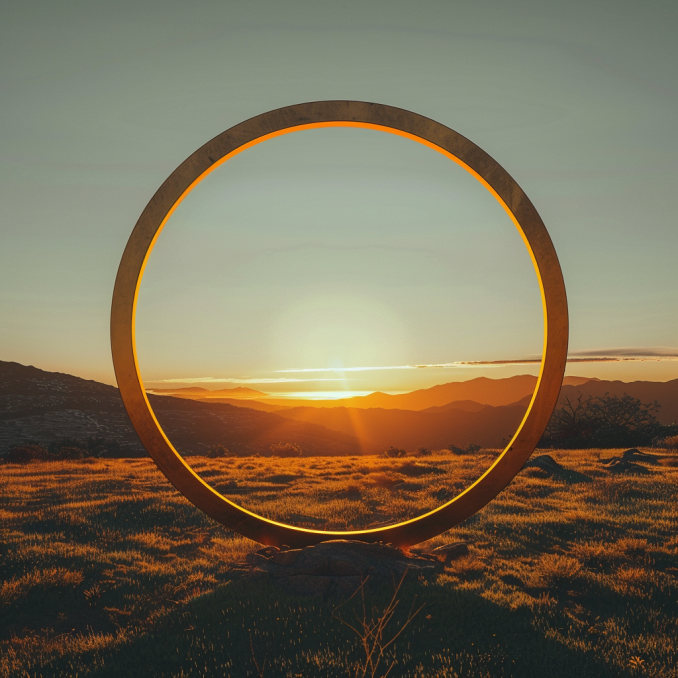

# Stakeholders
Currently, my primary focus lies in exploring our interactions with technology: how we engage with it, its roles in our lives, its impact, and its potential to shape our future. At this initial stage, my attention is directed towards stakeholders who can spark meaningful conversations and guide the direction of my research. As the project evolves and starts to crystallize, I aim to connect with various groups already immersed in AI and technological fields. Consulting with them will not only provide valuable insights but also assist in steering the project towards a practical outcome.

This approach serves as a dynamic tool for me, enabling the creation of a fluid visual representation that leverages available resources. It propels my research and projects into new realms and pathways, often beyond my initial contemplation.

 

# Tandem Project

# Storytelling
 

# Golden Circle 
 
 
*Why* 
 I aim to positively impact the future of our work by exploring how we interact with technology (hardware and software today) and the consequences of technological fatigue. I'm also keen on understanding the influence of remote working on our professional lives. My goal is to contribute to a future where technology meets well-being in balanced ways. And probably introducing nature to the experience. 
 
*How* 
I plan to change the way we think about and use technology by introducing new experiences. By using art installations and visual projections, I want to raise conversations about the influence of tech in our lives. And explore hoe we can find less exhausting ways to work, study, or research with immersive experiences. These experiences are meant to make people think about their tech habits and imagine a future where technology supports us in healthier ways.
 
*What*  
My project is about creating engaging, immersive experiences that challenge the way we interact with technology. Through art and visuals, I'll present alternatives that encourage us to reflect on our tech use. The aim is to spark discussions and thoughts about how we can use technology in a way that's beneficial and balanced, avoiding tech burnout.

# Communication Matrix
 

Reflecting on the communication strategy matrix for my project, I recognize it as a crucial guide for connecting with key groups—communities, tech experts, culture and media, and entrepreneurs. Each group offers unique insights and opportunities to advance the conversation on our relationship with technology. By addressing each audience's specific challenges and tailoring my messages, I aim to engage them deeply and inspire action.

This strategy highlights the importance of diverse approaches and collaboration. Engaging with technology experts enriches the project with in-depth knowledge, while culture and media help amplify its societal impact. Entrepreneurs and engineers, on the other hand, can help turn conceptual ideas into practical solutions.

The matrix is more than just a messaging tool; it's about building a community of like-minded individuals and entities. It emphasizes the need for dialogue, openness to feedback, and the willingness to adapt. This approach is key to not only envisioning but actively creating a more balanced digital future. It reflects my commitment to a collaborative, dynamic journey towards redefining our interaction with technology.

