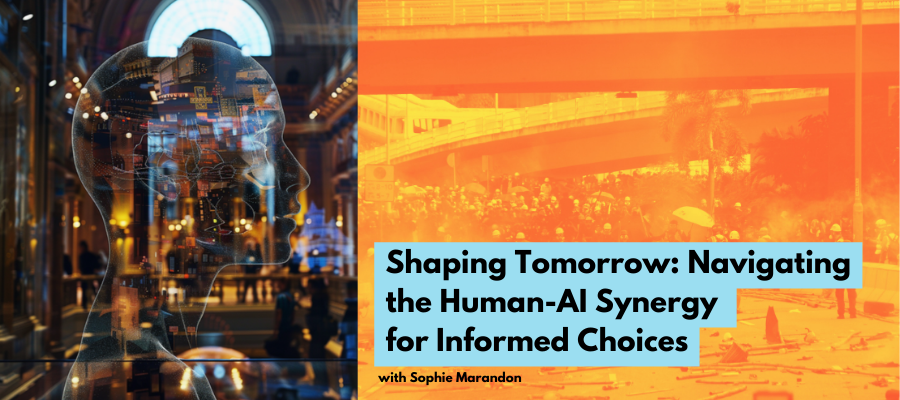

# Tandem Project
 

I partnered with Sophie Marandon on the tandem project because we have been working on AI for different projects but from different perspectives, so I was interested to see where she wants to take her project, considering her policy background.

To start and give you a hint, from my perspective, her project could be titled "Shaping Tomorrow: Navigating the Human-AI Synergy for Informed Choices."

<iframe width="560" height="315" src="https://www.youtube.com/embed/2u1P36bMO7w?si=b5CXVLDvnSesBHLa" title="YouTube video player" frameborder="0" allow="accelerometer; autoplay; clipboard-write; encrypted-media; gyroscope; picture-in-picture; web-share" referrerpolicy="strict-origin-when-cross-origin" allowfullscreen></iframe>

Sophie's project stands at the intersection of AI, identity, and society, tackling the profound implications of AI's growing role in our lives. By examining how AI perceives and influences identity, her research delves into uncharted territories of digital identity and the potential reshaping of our self-conception. Her findings highlight a worrying trend: the increasing trust in AI over human intuition, particularly in recognizing emotions. This shift underscores a broader societal reliance on technology, prompting critical questions about autonomy, surveillance, decision-making, and the potential loss of individuality.

Her motivation, rooted in her policy background and a quest for tech understanding, reflects a deep commitment to navigating the ethical labyrinth of AI integration. This dedication is crucial in an era where AI's capabilities and applications are expanding rapidly, often outpacing regulatory frameworks and societal comprehension.

The are many real-world implications of her project; by highlighting the uncritical acceptance of AI and its 'perfection,' she urges a societal reflection to foster a more informed and ethical coexistence with technology. Her research is a call to action, emphasizing the need for collective awareness and empowerment to shape a future where technology augments rather than diminishes our humanity. 

Looking forward, her project serves as a beacon for societal engagement with AI, leading to a future crafted by informed choices and ethical considerations. It's a reminder of the power of questioning and the importance of maintaining control over the technology that increasingly defines our world. Through her work, she envisions a society that embraces AI's potential while remaining vigilantly aware of its impact, ensuring a future where human identity and agency are preserved and celebrated.

Building on my reflection, I'm particularly captivated by the insight into how AI can shape society and the unseen effects that might subtly steer our decisions. This understanding is crucial in the policy arena, as it highlights the notion that collective decisions, often thought to be the product of wide consensus, may actually be influenced or preconceived by certain individuals or algorithms. This acknowledgment is vital as it exposes the intricate dynamics at play in our increasingly digitized society. 

Yet, this realization also opens a promising door: by thoughtfully leveraging AI, we can either predict or become more aware of the possible outcomes of various policies. This dual capacity of AI, as both an influencer and a mechanism for enhanced awareness, underscores the urgent need for a sophisticated approach when merging technology with societal decision-making. This deeper comprehension fuels my eagerness to continuing this tandem to dive into the complexities at the confluence of technology, society, and policy.