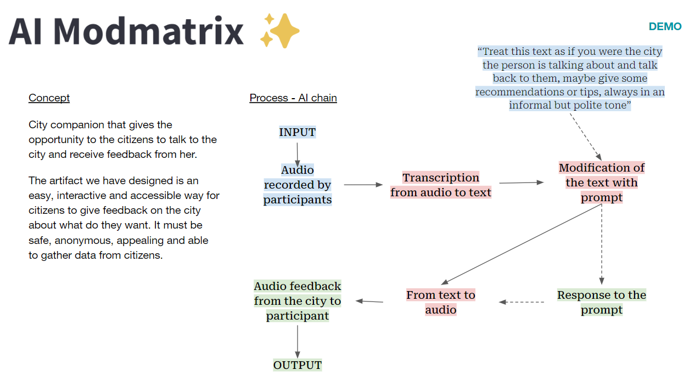

# Designing with Extended Intilligences 
The seminar was well designed to deepen our understanding of artificial intelligence , with a specific focus on its practical application. 

Hosted by Pietro and Chris, both alumni of MDEF, the session was marked by its dynamic and engaging approach to exploring AI and its immense potential. The seminar initiated, off course, by defining AI and the evolution of these models. 

 
 

Pietro and Chris are also members of a collective called Dottod, through which they have initiated a series of really interesting projects. Their work within this collective aims to spark discussions on a variety of important topics, including politics, design, technology, and more. Take a look here https://www.dottod.net/ and here https://furnitures.dottod.net/

Particularly, I liked how they use AI in their projects to raise awareness of the technology's power, highlight its biases, and blend it with art to provoke reflection.

## Try the Dottod Camera
https://camera.dottod.net/

Here are some prompts that Nuria, Marius, and I experimented with.
 
 
 

In this activity, we tried with various prompts to see how the images would change. We also used some cameras, filters, and extra elmentss I've previously used to generate images in Midjourney to compare it to this model. I liked the way this model works because you can add or substract elements but the essence of the picture remains. 

## Modmatrix 
[Modmatrix](https://modmatrix.app/) is a simple AI project prototyping tool, inspired by synthesizer modulation matrices.
 
 
We used the app to play with text to image, audio to text and text to model. I liked the feature of the Optional Modifying Prompt because I think is an easy way to create a character, story, filter on top of GPT-4 intelligence. This helps you prototype and pivot ideas really fast. Moreover I used the app to explore the following:  
    1. *Original description of the V60 Dripper (text) to image.* The output wasnt really good, I think its because the author wrote the description in a more inspirational and poetic way rather than descriptive.  
    2. *Image of a V60 (image) to text and then to image.* This output was much better than the first one, so we now can assume that the description of this model is very accurate.  
    3. *Previous GPT-4 description (Text) to Zoo CAD model.* This output was really bad, Kitty CAD still has to improve. 
    4. *Text to 3D - Simple text "Coffee dripper V60" in Zoo CAD.* The output was much better than the previous one, it seems that the dataset has a good reference for basic things.  
    5. "Text to 3D - Coffee dripper V60" in SHAP-E*. Even though you could recognize that it was a coffee cup or a dripper the image was really small, bad quality and had space for imporvement.  

## Reflection 
I personally like AI and believe it can make a lot of tasks easier and more efficient. However, the potential outcomes of this technology can be both fascinating and creepy.It's important to talk about and be aware of issues like unfairness, how much data is collected, and keeping data private. Before GPT came out, I was in charge of managing an AI bot, and I also enjoy creating images with Midjourney as a hobby. Both experiences have helped me understand AI better. This seminar, however, has expanded my perspective significantly, providing insights from a developer's viewpoint. It has opened new possibilities, encouraging me to experiment with various models for a wide range of purposes.

