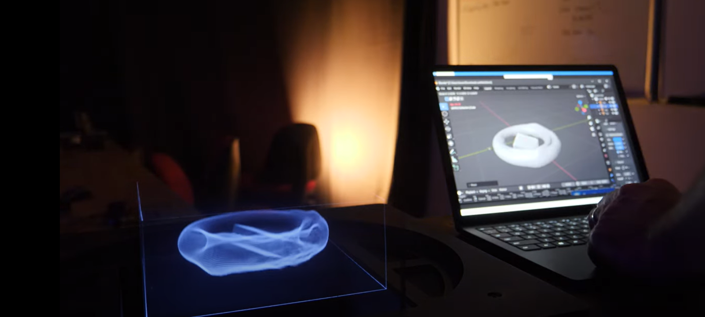
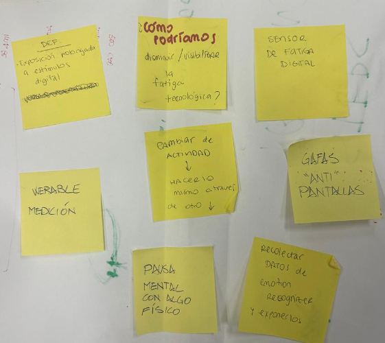
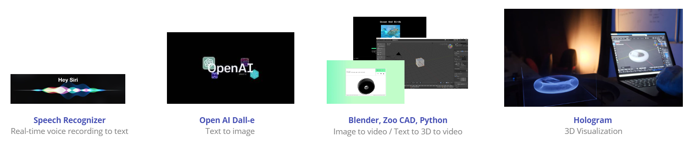
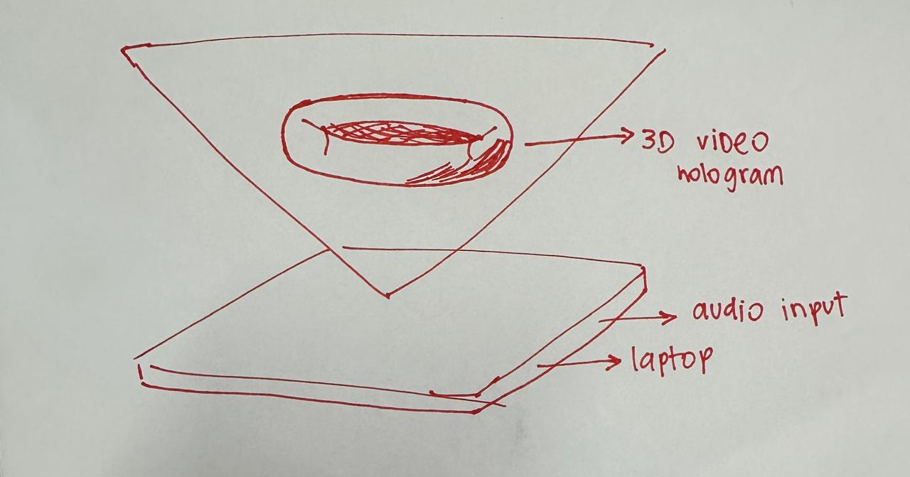
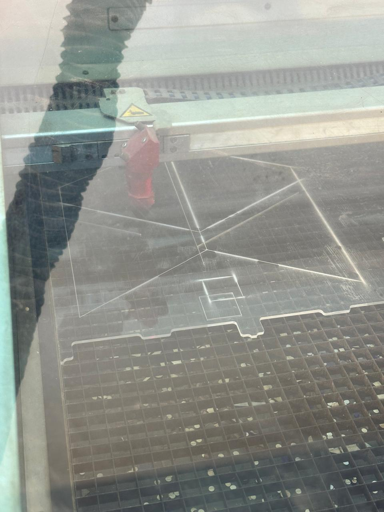
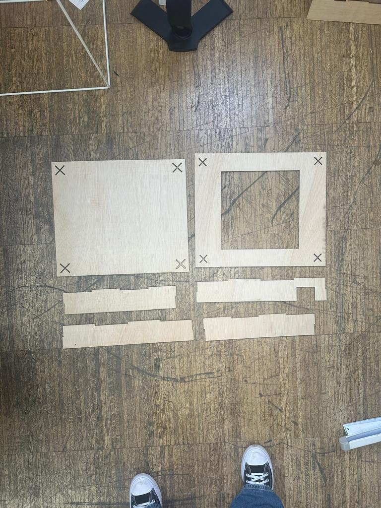
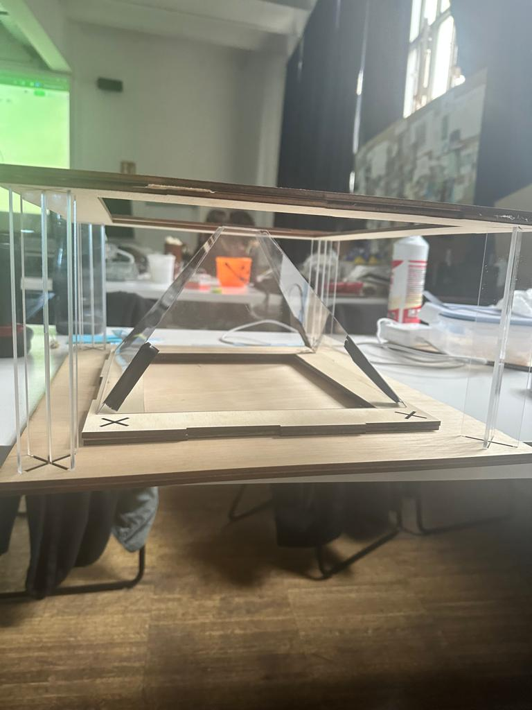
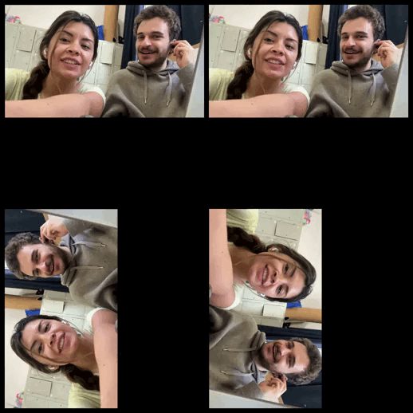

# Microchallenge: Immersive Experiences
 

For this microchallenge, Jorge and I decided to partner up to create an artifact that reflects our shared interests. We did some brainstorming about our main inqueries and interests. 
 

I've been researching by our relationship with technology and how AI might shape us in the future. However, for this microchallenge, I wanted to focus on the *physical* impact of technology use. I was inclined by the approach of technological fatigue. *Technological or digital fatigue is a widespread issue that has gained significant attention, especially in the context of increased screen time and reliance on digital devices for work, education, and socializing.* Digital fatigue manifests as a form of mental exhaustion resulting from excessive screen time, impacting productivity and well-being  

Moreover, from my personal experience, I tend to work from 12 to 14 hours a day on my laptop, and this is an increasing behavior I've been observing more frequently. Thus, I decided to explore new methods of immersive learning, working, or researching that go beyond traditional devices, even VR, because it can also lead to digital fatigue.

We created an AI hologram. It's an AI assistant for both designers and non-designers, designed to help you find inspiration for projects in a non-traditional way. Holograms, in their most basic form, are very old technology, yet their high-tech evolution is a volumetric display. On the first day, we delved into how we could utilize the space surrounding the laptop, where people regularly work, and the various methods of creating a hologram or a low-tech projector. 

 

# For the prototype:
We learned about the Pepper's Ghost effect and various ways to prototype the display. The simplest method we found was the pyramid effect, so we decided to laser cut a first sample to see if it actually worked. We used some YouTube videos featuring the pyramid hologram effect to test its functionality.

 
<video controls src="../images/jorgepiramid.mp4" title="first try"></video>

# For the intelligence:
Inspired by Modmatrix, we aimed to produce an AI that could generate an image from a prompt. We enhanced the experience by enabling voice commands instead of typing, allowing it to connect with Dall-e for creative inspiration or with KittyCAD for 3D modeling needs. Furthermore, we needed to achieve a four-screen video reflection for the pyramid from the AI output. It took some time, but ultimately, we managed to do it with Blender and Python. Check our repository [here](https://github.com/jmuozan/AI-generated-holograms).

C:\Users\vani\MDEF\mdef-template\docs\term1\hologram4.mp4

<!--*add images and gifs here of the build process* -->
<!-- Markdown Content -->

  
  
  
  
  <!-- Add more images as needed -->

<!-- CSS Styles -->

Participating in this microchallenge was immensely enjoyable because we were deeply engaged in writing the code. I'm confident we improved our Python coding skills significantly through the use of AI tools, despite starting with limited knowledge. The coding took longer than expected, but we managed to make it work. For the pyramidal hologram prototype, I believe there is potential for further development since the displayed image was still quite small.

