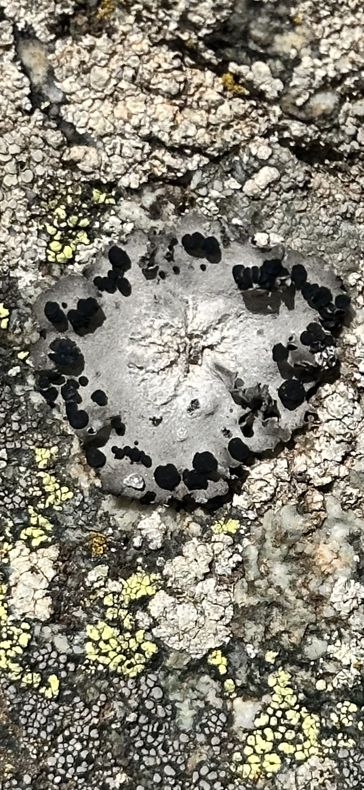

# Research trip

C:\Users\vani\MDEF\mdef-template\docs\images\IMG_6627.jpg
<!--*add images and gifs here of the build process* -->
<!-- Markdown Content -->

  
  
  
  
    <!-- Add more images as needed -->

<!-- CSS Styles -->

During our recent research trip to Augustine, located in the southern mountains of France, we immersed ourselves in the natural surroundings which provided both a tranquil setting and a fertile ground for exploration. Throughout the week, our activities ranged from hiking through rugged terrain, observing the local flora and fauna, to engaging in a deeper understanding of the small non-human beings that share our ecosystem. The culmination of our trip was the presentation of a project that synthesized our experiences and learnings.

## Key experiences:

Medicinal Plants Workshop: One of the most enlightening experiences was the medicinal plants workshop. As we trekked through the lush landscapes of Augustine, our guide, whose expertise in local botany was unparalleled, introduced us to a variety of plants and flowers. Learning to identify each one and understanding their healing properties was fascinating. It was a vivid demonstration of how local knowledge has harnessed nature's pharmacy for health and well-being.

Explorative Hiking: Another highlight was the extensive hiking experience. Unlike ordinary hikes, this was an exploratory journey that allowed us to actively engage with our environment. This was not just about covering distance but about truly being present in nature. The physical challenges of the hike, combined with the sensory engagement with the natural world, offered a profound connection to the landscape around us.

## Reflection

Reflecting on the trip, the first aspect that strikes me is the seamless blend of learning and environmental immersion. The medicinal plants workshop was not only educational but also a reminder of the often-overlooked resources in natural habitats. It highlighted the importance of traditional knowledge and its relevance in contemporary health practices.

The hiking experience, on the other hand, was a personal journey. It allowed me to disconnect from the digital world and reconnect with nature. The physical effort required to navigate the trails was a meditative practice in itself, fostering a sense of mindfulness and presence that is rare in our everyday lives.

## About my project
This trip reinforced my appreciation for nature's complexity and beauty. It also highlighted the importance of conservation and sustainable interaction with our environment. As we presented our projects at the end of the week, I felt a deep sense of responsibility to integrate these insights into my personal and professional life, promoting nature. For my project i was very inspired in the textures and colours of nature. So I decided to explore AI models to combine daily life objects such as lamps or chairs, which usually are built with human-centered materials such as metal or sanded wood, to convert their materiality in terms of texture and color to the ones from Augustrine. It took some time until the prompting in Midjourney and Dall-e could get to the final images but it was really interesting the process of how AI perceive and blend with nature. 

In conclusion, the research trip to Augustine was not just an academic exercise; it was a transformative experience that deepened my understanding of nature's role in our lives and our impact on it. It was a vivid reminder of the delicate balance we must maintain with our natural surroundings to foster a sustainable future.