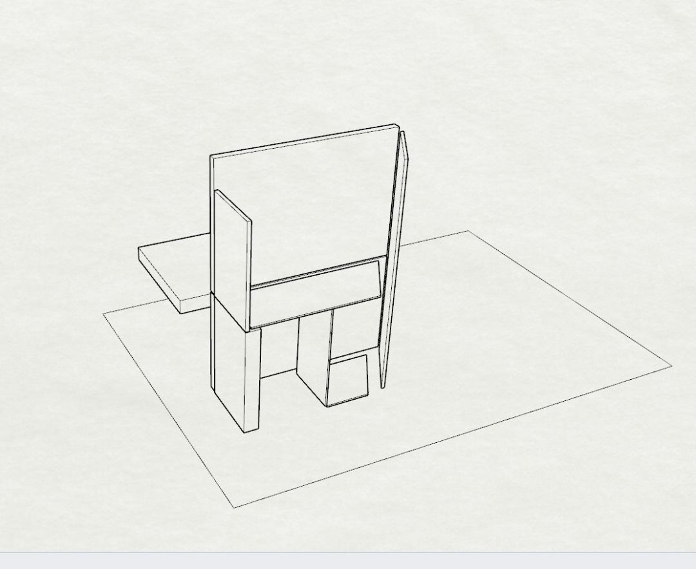
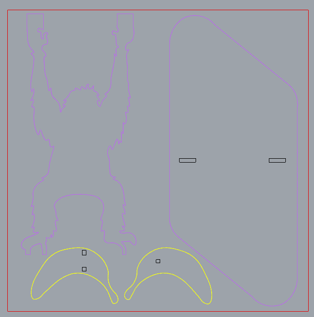
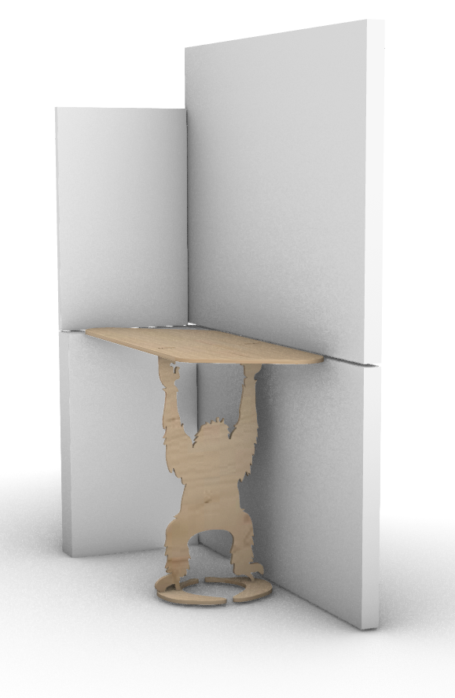
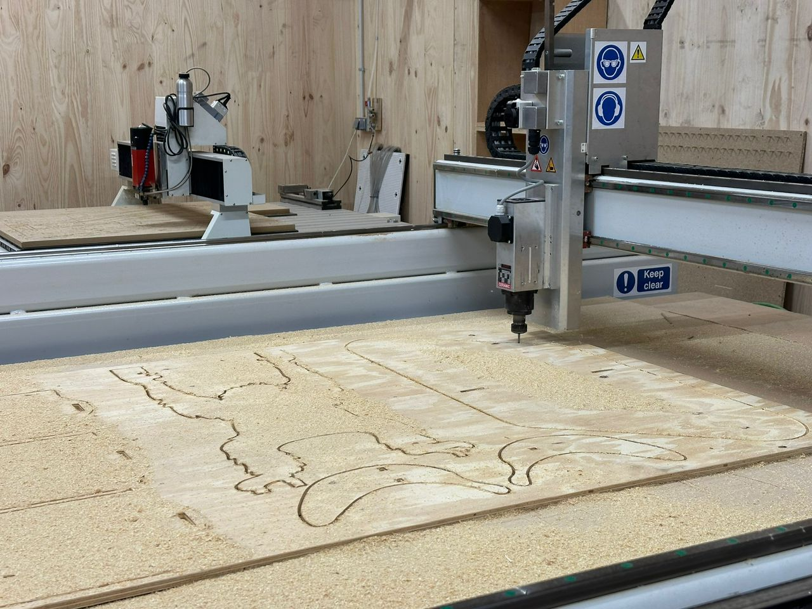
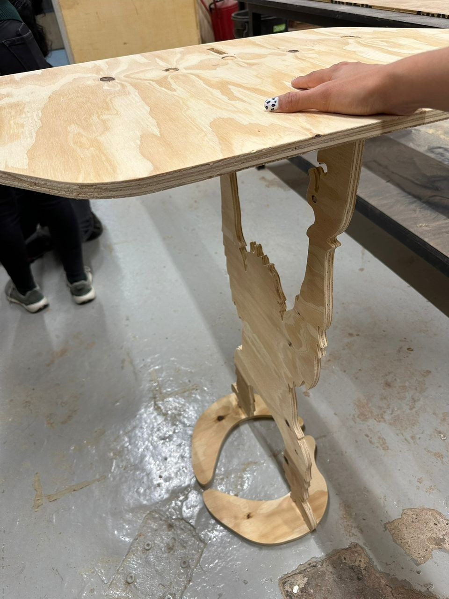
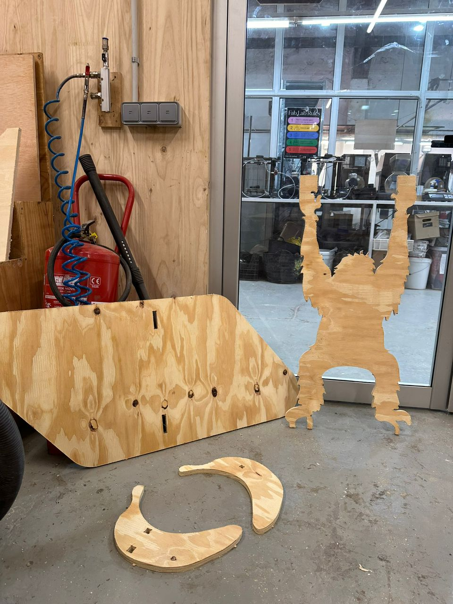
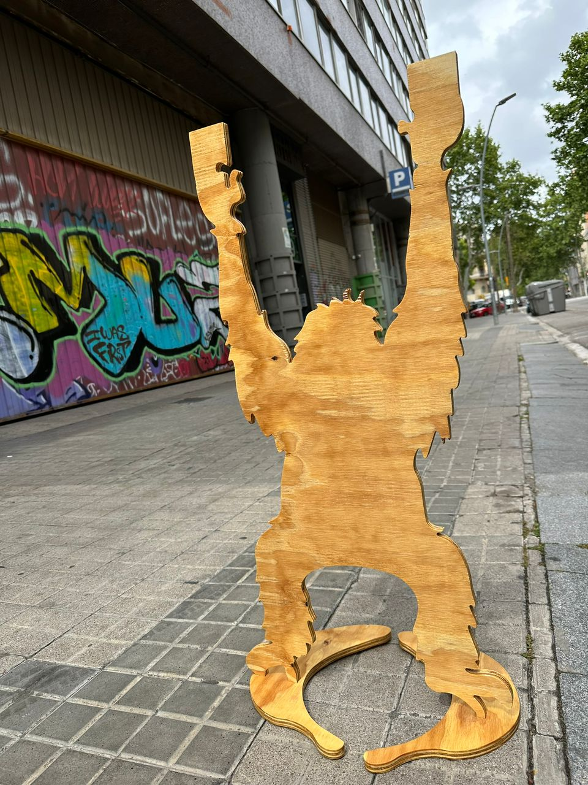

## Fabricate a piece of furniture

| Complexity | Skills |  Duration |   
| :---:| :---------: | :---: | 
| Medium | CNC Milling |2 days |

For this module, we needed to create a piece of furniture with plywood. The concept was to create a side table, and we brainstormed ideas on how to make it more playful and unique. In the end, we decided to create a monkey with bananas design.

## About CNC
CNC (Computer Numerical Control) machining is a
subtractive manufacturing technology: parts are created
by removing material from a solid block (called the blank
or the workpiece) using a variety of cutting tools.

[Fablab documentation about cnc](https://fablabbcn-projects.gitlab.io/learning/educational-docs/mdef/classes/cnc/)

## For the Design 

## Gcode 
[Gcode here](https://github.com/33dudu/CNC-monkey/tree/main)

## Final Result

## Facts
Me and Qianyin, designed and build a side table featuring a monkey with bananas. We created the G-code, understood the milling process, ensured proper spacing for assembly, sanded everything, and applied a finish to the wood.

## Feelings
I felt a mix of curiosity and apprehension as we tackled the project. Seeing the final assembled piece brought a sense of accomplishment and joy.

## Findings
I learned the importance of precise measurements and planning in CNC milling. Additionally, I gained hands-on experience with G-code creation and machine operation.

## Future
I will prioritize precision and thorough planning in future projects. This experience has inspired me to explore more creative and functional designs. Next time i would like to do something similar to this [bee home](https://space10.com/projects/bee-home).

