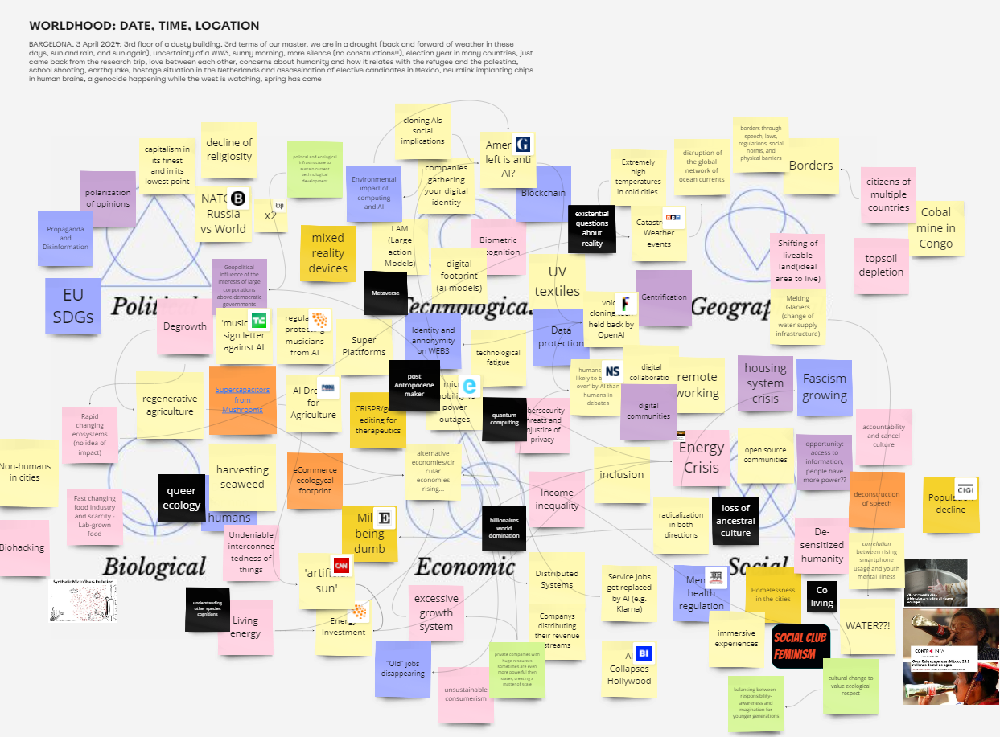
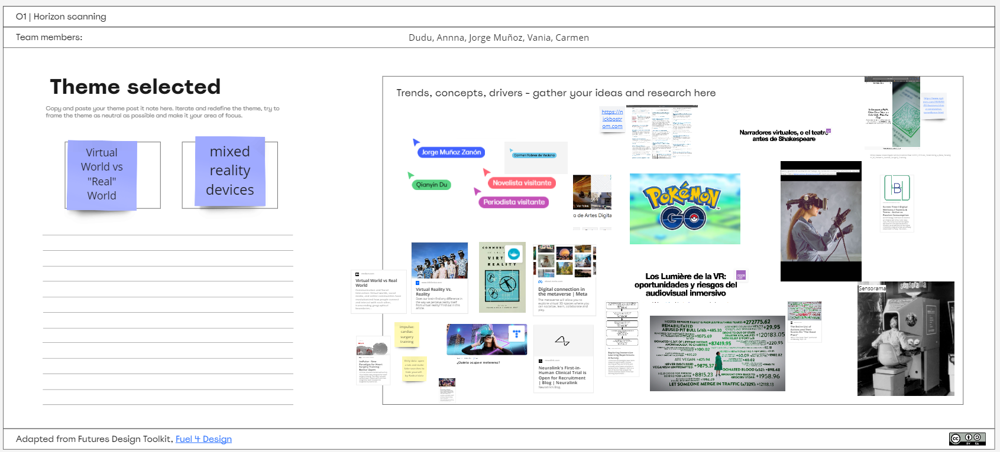
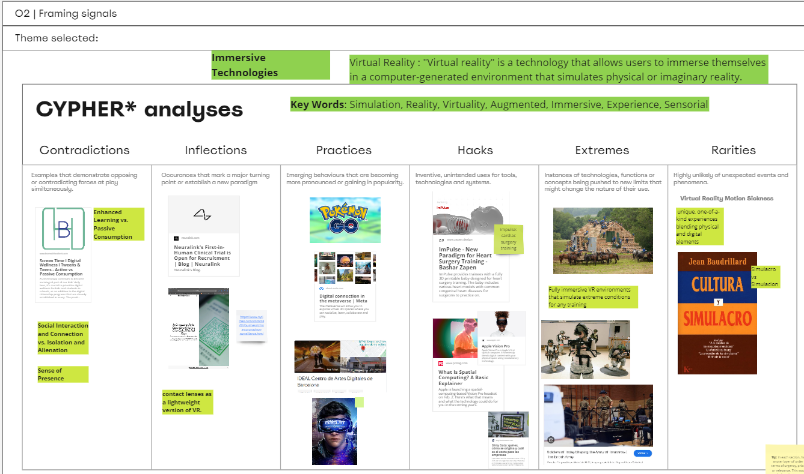
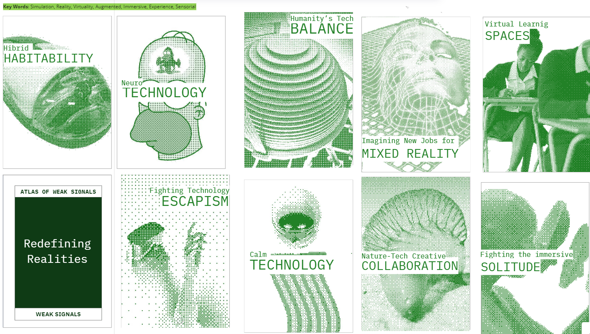
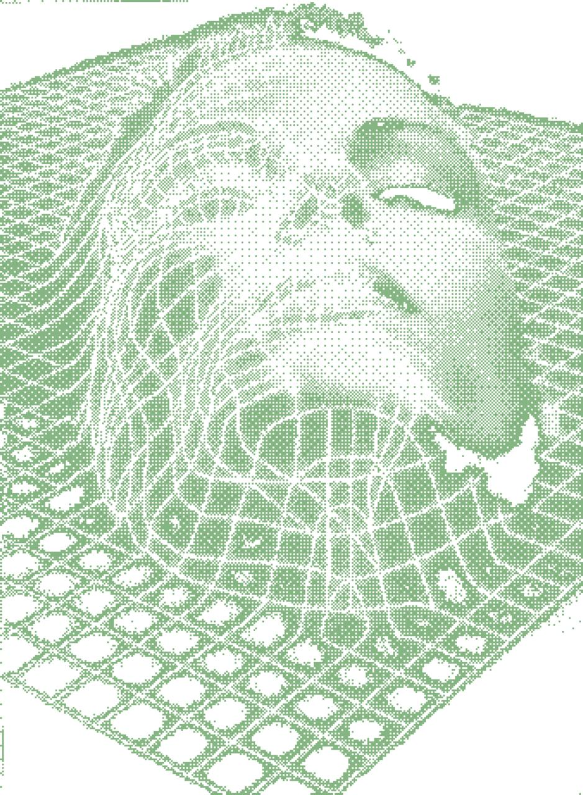
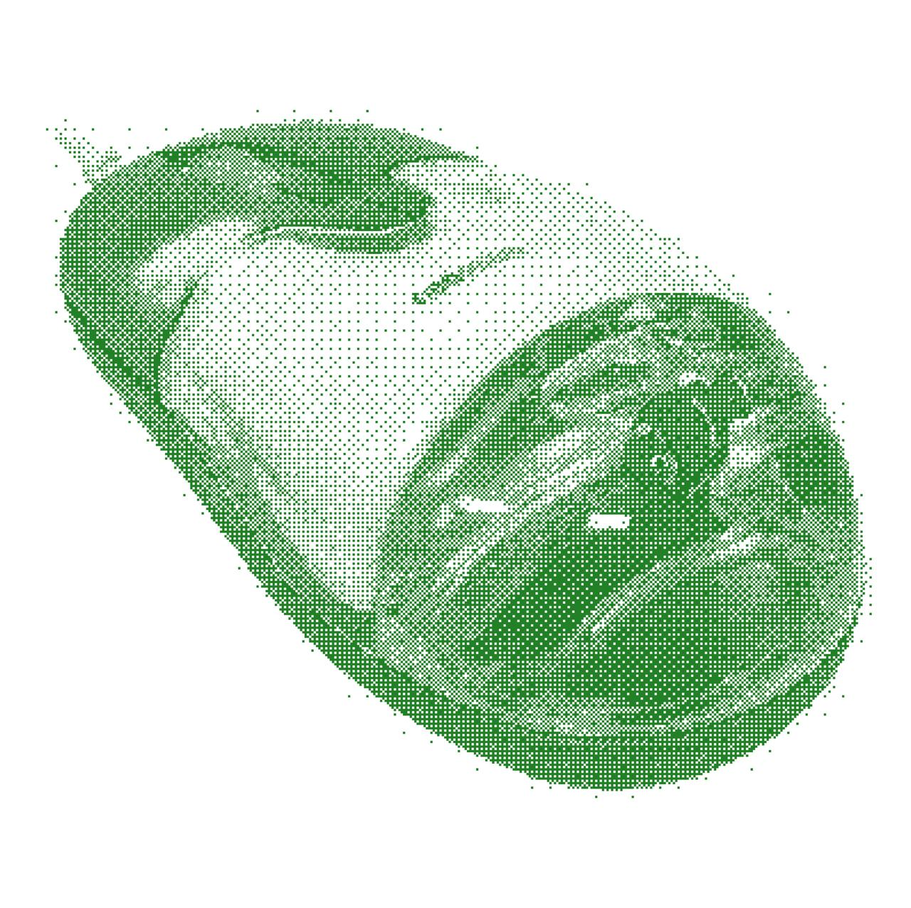
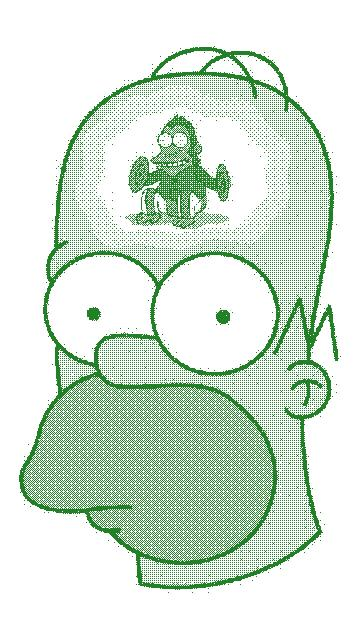
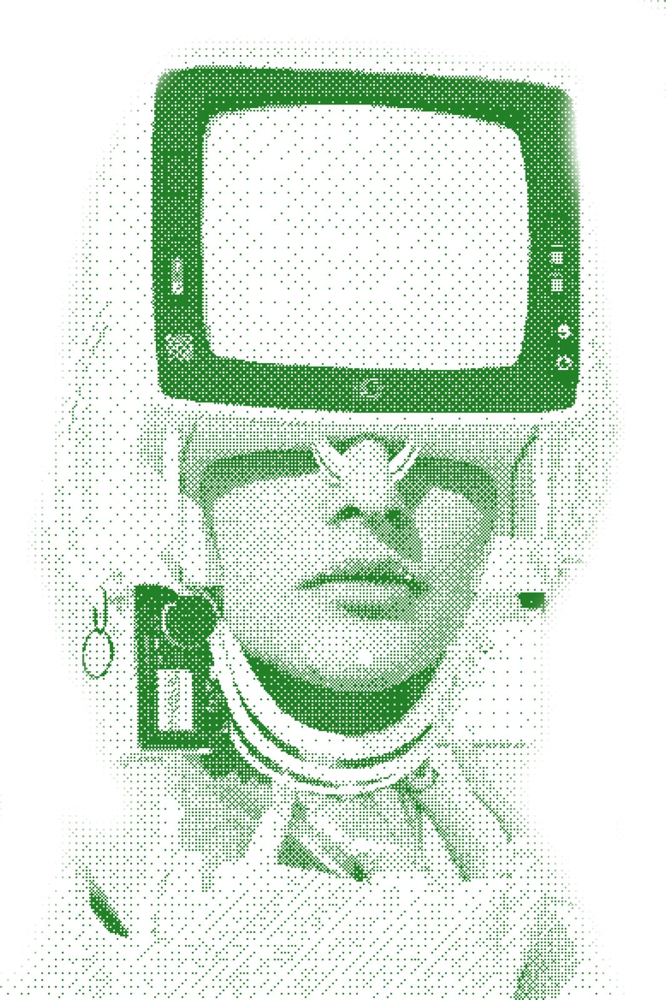
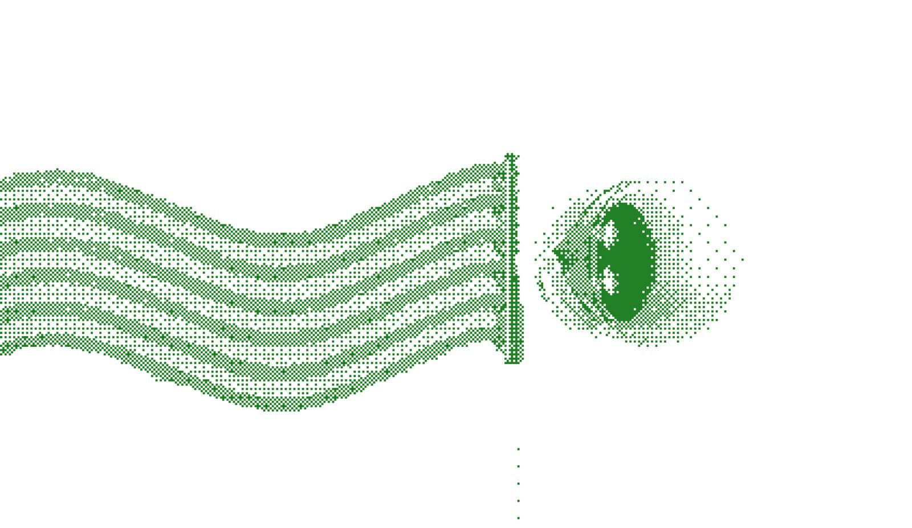
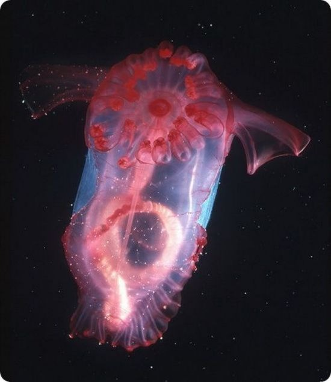

 

## Revisiting the AOWS - Collective sharing round and reflection
 
We started by sharing our main interests, which led my group and me to focus on technology, specifically immersive experiences and their interplay with nature. This initial discussion was crucial as it set the foundation for our collaborative efforts and provided a clear direction for our research. It was exciting to see how aligned we were and how this focus could potentially influence our project outcomes.

## Horizon scanning exercise - Materializing trends in the polycrisis

 
During the horizon scanning, we dove deep into current trends and future possibilities at the nexus of technology and nature. This exercise involved extensive online research to gather insights on emerging technologies in immersive experiences. It was a thorough exploration that grounded our project in real-world contexts and helped us understand the broader implications of our chosen theme.

## CIPHER methodology application for identified themes - Utilizing existing methods to frame signals and test it for their validity

 
Utilizing the CIPHER methodology to frame and analyze the identified themes was enlightening. We laid out all the information in a matrix, considering extremes and rarities, which deepened our conversation about immersive technology. Thinking about how these technologies could be perceived as either creepy or cool added a rich layer of analysis and helped us understand the nuances of societal impacts better.

## Creative expression of the newly identified cards

 
Defining and creating eight new cards to represent weak signals in our area of focus was a highly creative and engaging process. This stage allowed us to transform our research and ideas into tangible outputs that could be shared and evaluated. Each card was a representation of potential futures, and crafting these gave me a sense of contribution to the broader discourse on technology and nature.

## Polarization and provocation - A critical reflection on the identified signals
We concluded with a critical reflection on the identified signals by engaging in an embodied dynamic to assess whether each signal provoked thoughts, actions, or self-reflection. This activity was challenging yet rewarding, as it pushed us to consider diverse perspectives and the provocative nature of our signals. It was a fitting end to our project, encapsulating the complexities and the potential impact of our work.

# JPG Assets
<!--*add images and gifs here of the build process* -->
<!-- Markdown Content -->

  
  
  
  
  <!-- Add more images as needed -->

<!-- CSS Styles -->

<!--*add images and gifs here of the build process* -->
<!-- Markdown Content -->

  
  
  
    <!-- Add more images as needed -->

<!-- CSS Styles -->
