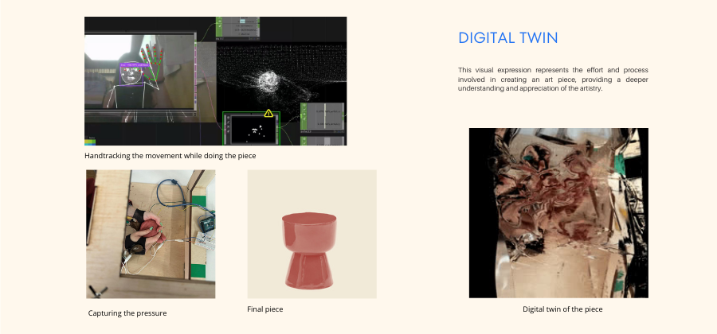
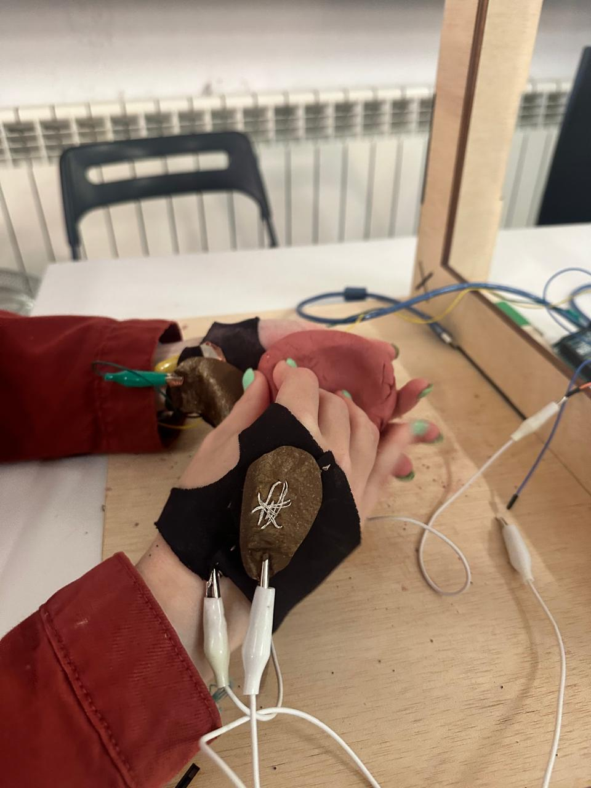
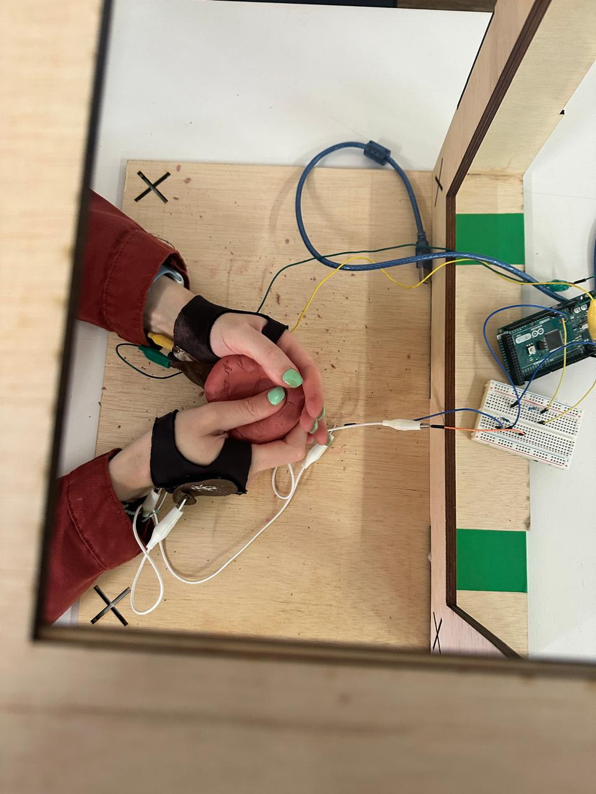

## Microchallenge: Digital Twin
For this microchallenge, I wanted to learn more about TouchDesigner and explore its potential with different inputs. Over the past few months, I have been intrigued by Mediapipe and its various applications. Jorge and I were exploring its uses and its connection to craftsmanship. Although we didn't collaborate directly on this challenge, each of us focused on learning a different skill. We worked together to better understand the tool and develop some workarounds in our processes.



## Finding Inspiration in TouchDesigner
TouchDesigner artists are creating remarkable work using sensors, cameras, audio, voice, and more. It offers an immersive experience. Here are some designers using TouchDesigner:

## The Concept
An art piece digital twin, it visually represents the effort and process involved in creating an art piece, providing a deeper understanding and appreciation of the artistry.

## Mediapipe
After exploring various ways to connect Mediapipe, I discovered a method using a Mediapipe GPU Plugin for TouchDesigner.Here is the [tutorial](https://www.youtube.com/watch?v=Cx4Ellaj6kk), made by Torin Blackensmith, from which I learned. Additionally, [here is the repo](https://github.com/vania-bisbal/mediapipe_api) where I include the Mediapipe installation and the Arduino code I will be using later. Once Mediapipe is installed in TouchDesigner, it can be used for pose tracking, hand tracking, object recognition, and other gesture recognitions.

## Electronic Gloves Prototype


### TOOLS

!!! example ""

    * [ELEGOO Electronic Fun Kit](https://www.elegoo.com/blogs/arduino-projects/elegoo-electronic-fun-kit-upgraded-electronic-fun-kit-tutorial) 
    * Software:  [Arduino IDE](https://docs.arduino.cc/software/ide-v1)
    * Hardware: [Seeed Studio XIAO ESP32C3](https://wiki.seeedstudio.com/XIAO_ESP32C3_Getting_Started/)


While using Mediapipe's hand tracking, I realized that hand-tracking alone wasn't sufficient to measure the artist's effort while creating a piece. So, I decided to create a pair of electronic gloves to capture the pressure exerted on the material.

To create the gloves, I used documentation on soft robotics from Fabricademy students. I used neoprene for the glove prototype and Velostat for the circuit. I also used conductive fabric and conductive thread to test the conductivity.

When the gloves were ready, I connected them with crocodile cables to an Arduino to run the code and start receiving data. Here is the Arduino code.

* Code for reading the change in values when pressing against the material with the gloves:

```

int sensorPin = A1;    // Define the pin for sensor input
int sensorValue = 0;   // Variable to store the sensor value

int sensorPin2 = A2;    // Define the SECOND pin for sensor input
int sensorValue2 = 0;   // Variable to store the sensor value

void setup() {
  pinMode(sensorPin,INPUT);
  pinMode(sensorPin2,INPUT);
  Serial.begin(9600);    // Initialize serial communication at 9600 baud rate
}

void loop() {
  sensorValue = analogRead(sensorPin); // Read the digital value from sensorPin
  Serial.print(sensorValue);          // Print the sensor value to the Serial Monitor
  Serial.print(",");
  //digitalWrite(pinD, sensorValue);      // Optionally write this value to pinD (for example, to turn on/off a LED)
  sensorValue2 = analogRead(sensorPin2); // Read the digital value from sensorPin
  Serial.println(sensorValue2);          // Print the sensor value to the Serial Monitor
  delay(200);                           // Wait for 500 milliseconds before next read
}


```


Here are more resources about soft robotics I found interesting:
-
-
-

## TouchDesigner
After validating the data from the gloves, I watched some tutorials to send the serial plotter data from Arduino to TouchDesigner. Initially, I encountered some difficulties, but it was relatively easy to set up once I got the hang of it. You need to open a serial component to start receiving data from your Arduino. Ensure the data is separated by commas for easy identification. Since I had right and left gloves, I needed to isolate each data point.

With both inputs—Mediapipe hand-tracking values and the pressure from the gloves—I used some tutorials to create effects. I enjoyed the Blob Tracking and the particle rain effects. Here are some of the tutorials: XXXX

## Setup
For the final setup of the prototype, I recycled a piece of wood from my previous microchallenge. I realized it was easier and more efficient to use my mobile camera instead of the laptop one. This allowed for better placement and adaptability to different artistic practices. For example, ceramics differ from glass blowing. I used OBS Studio to control the cameras I connected to TouchDesigner. It automatically appears as an option in TouchDesigner. Additionally, I used VDO.Ninja to broadcast from my phone. You can also broadcast from anywhere in the world using a QR code. Here you can see the tutorial: XXXX

## Output Video and Experience
https://vimeo.com/961037341

Learning more about TouchDesigner and diving into additional areas like soft robotics, Arduino, Python, and OBS Cam was a fascinating experience. I had a lot of fun and was deeply interested in the immersive experiences you can create by tracking or monitoring gestures, poses, and hands from a camera. There were some challenges; initially, I wanted to create a matrix for the gloves to receive more data or even measure the fingers. However, Santi suggested keeping it simple (MVP) so I could manage to make everything work. Luckily, I followed that advice and continued with simple gloves; otherwise, I would have run out of time. I am eager to continue exploring soft robotics and TouchDesigner with the Mediapipe API.

Matrix copper inspiration https://www.kobakant.at/DIY/?p=7943
https://www.youtube.com/watch?v=swTN-SDRViU

Connie AI artist
https://www.artconnect.com/connie-bakshi-XLwfXhEy2e2G4aaVEkMcl
https://www.stephaniedinkins.com/
artisan vr https://mw17.mwconf.org/glami/weaving-a-better-future-virtual-reality-app/
deezen https://www.dezeen.com/2013/11/20/honey-bees-can-be-trained-to-detect-cancer-in-ten-minutes-says-designer-susana-soares/
space plants https://www.instagram.com/p/CHu4TVyhgXX/?epik=dj0yJnU9NTU0ZGE3blZoYUF3d05NUXhJX3NMS1laSWcyakhqNDgmcD0wJm49cl82TWhjbzlqRnlqWTA0bzN3XzRWUSZ0PUFBQUFBR1k3OVp3&img_index=1
https://www.instagram.com/laragess__/
https://www.leeboroson.com/art/category/recent-projects lee boronson
everyday objects https://hotelsabovepar.com/objective-gallery/

https://www.meikeharde.com/portfolio-item/chromatographics/ chromatographics

mediapipe https://github.com/mgyong/awesome-mediapipe?tab=readme-ov-file#desktop-examples
torin mediapipe https://github.com/torinmb/mediapipe-touchdesigner/releases

https://derivative.ca/community-post/tutorial/overstim-sim-experience/68549